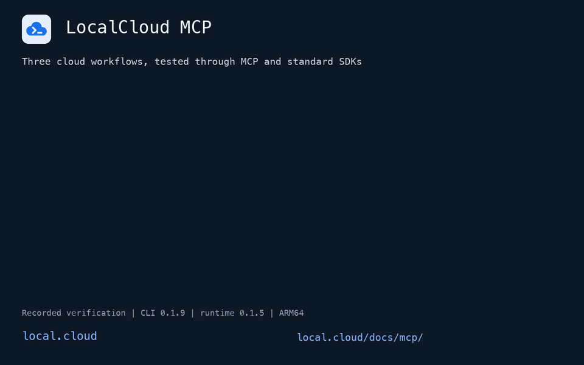

<div align="center">

# LocalCloud CLI

**A free local cloud environment for developers and AI coding agents.**

Build, test, and debug Google Cloud applications from your terminal or coding agent.
MCP connects your agent to local services, SDK configuration, test data, readiness, and diagnostics.

Run local service workflows without Google Cloud service charges, start with one command,
and create local projects for your experiments and test suites within your machine's capacity.

[Website](https://local.cloud/) · [MCP guide](https://local.cloud/docs/mcp/) · [Claude & Codex marketplace setup](docs/mcp-marketplace-guide.md)

[](https://github.com/LocalGCloud/localcloud-cli/releases)
[](https://local.cloud)
[](https://www.docker.com)
[](https://modelcontextprotocol.io)
[](https://www.python.org)
[](LICENSE)

[Install](#install) · [Quickstart](#quickstart) · [How it works](#how-it-works) · [Services](#services) · [Commands](#commands) · [AI agents & MCP](#ai-agents--mcp) · [Troubleshooting](#troubleshooting)

</div>

---

`localcloud` (aliased `lc`) is the official host CLI for [LocalCloud](https://local.cloud). It manages the
container runtime lifecycle, multi-project context, SDK environment variables, persistent Docker volumes,
and the Model Context Protocol bridge — so your application code keeps calling the same Google Cloud client
libraries it already uses, just pointed at loopback.

```console
$ lc doctor
╭── LocalCloud v0.1.9 ────────────────────────────────────────────────────────────────────────╮
│                            │ Top commands                                                   │
│ Checking LocalCloud setup  │  localcloud (or lc)    status | start | stop | restart         │
│                            │  eval $(lc env)        Exports env vars that redirect cloud se…│
│           ╭────╮           │────────────────────────────────────────────────────────────────│
│        ╭──╯    ╰──╮        │ Context                                                        │
│       ╭─╯        ╰─╮       │  Data Volume: localcloud-data        Project: local-gcp-project│
│      ╭╯            ╰╮      │  User: local-developer                Config: built-in defaults│
│      ╰──────────────╯      │  Data: persistent                                              │
│                            │                                                                │
│      27 GCP Services       │                                                                │
│   ● 22 active · ○ 5 opt    │                                                                │
│                            │                                                                │
├────────────────────────────┴────────────────────────────────────────────────────────────────┤
│ Supported Services (● 22 enabled · ○ 5 disabled)                                            │
│  ● Storage      ● Pub/Sub      ○ Firestore    ● Bigtable     ● Spanner      ● BigQuery      │
│  ● Cloud SQL    ● AlloyDB      ● Memorystore  ● Dataproc     ● Tasks        ● Scheduler     │
│  ● Functions    ○ Cloud Run    ○ Compute      ○ GKE          ● Workflows    ○ Vertex AI     │
│  ● Sheets       ● KMS          ● Secrets      ● IAM          ● Logging      ● Monitoring    │
│  ● Resource Mgr ● Service Usage ● Billing                                                   │
╰─────────────────────────────────────────────────────────────────────────────────────────────╯
 Tip: Run localcloud guide for AI agent workflows, or lc for the fast alias.

Status  OK
Docker  29.8.1 (/opt/homebrew/bin/docker)
Image   agentcloud/localcloud:latest
Ports   5380-5406 (in use by localcloud)
```

## Why LocalCloud

- **27 services, one container.** Storage, Pub/Sub, BigQuery, Spanner, Bigtable, Firestore, IAM, KMS,
  Dataproc, Cloud Run and more come up together — not as a dozen emulators you wire up by hand.
- **Your SDK code doesn't change.** `eval "$(lc env)"` exports the emulator variables the official Google
  client libraries already look for. Same calls, same objects, loopback endpoints.
- **Isolated, durable environments.** A named Docker volume is the runtime's identity. Run a scratch
  environment for CI beside your everyday one, and keep data across restarts.
- **Built for humans *and* automation.** Every command renders a readable terminal summary, and the same
  result as complete JSON with `--verbose`. `--dry-run` previews mutations; `--debug` prints the equivalent
  `docker run`.
- **Agent-native.** A first-class MCP bridge lets AI coding agents provision, seed, inspect, and reset real
  GCP-shaped state as part of their own loop — not a UI a person has to click through.
- **Zero live-cloud footprint.** The CLI validates that every generated endpoint is loopback and refuses to
  emit a real `googleapis.com` address. There is no silent fallback to production.

### How it compares

|  | **LocalCloud** | `gcloud beta emulators` | Testcontainers | Real GCP dev project |
| :--- | :--- | :--- | :--- | :--- |
| Services | **27** | ~5 (Bigtable, Datastore/Firestore, Pub/Sub, Spanner) | Wraps the same emulators | All |
| Setup | One CLI command | One process per service | Written in test code | Project, billing, IAM |
| SDK wiring | `eval "$(lc env)"` | Per-emulator, manual | Per-container, in code | ADC + real credentials |
| Web console | Built in | — | — | Yes |
| Terraform / OpenTofu | `lc env --format terraform` | — | — | Yes |
| Agent control (MCP) | Built in | — | — | — |
| Data persistence | Docker volume, survives restarts | Process lifetime | Test lifetime | Durable |
| Cost / credentials | None | None | None | Billed, real keys |

> Breadth is service **availability** — a callable, service-level integration. Operation-level parity is
> service-specific and recorded per service in the LocalCloud compatibility matrix.

## Install

### Prerequisites

Docker Desktop, Colima, OrbStack, Rancher Desktop, or Docker Engine, installed and running. LocalCloud
needs at least **4 GiB** of memory available to the container for stable operation.

No Docker yet? On macOS with Homebrew, `lc doctor --fix` (or `lc start` in a terminal) offers to install
[Colima](https://github.com/abiosoft/colima), a free, lightweight Docker engine, and starts it with 4 CPUs
and 8 GiB of memory.

On Apple Silicon, run the Docker VM on **VZ with Rosetta** rather than QEMU: it is faster, and QEMU has
known issues with LocalCloud (the BigQuery emulator can fail under it). `lc doctor` reports the Docker
app, its VM type and Rosetta, and `lc doctor --fix` offers to switch Colima or Rancher Desktop.

### macOS and Linux

```sh
curl -fsSL https://local.cloud/install.sh | sh
```

The installer adds `localcloud` and the shorter `lc` alias when available.

### Homebrew

```sh
brew install LocalGCloud/tap/localcloud

brew upgrade localcloud     # upgrade
brew uninstall localcloud   # remove
```

### Upgrading

Update the CLI to the latest release:

```sh
lc update
```

`lc update` detects how LocalCloud was installed (script installer or Homebrew) and upgrades the CLI in place. For Homebrew, `brew upgrade localcloud` also works.

### Standalone binaries

Signed release archives with Sigstore verification bundles are published for:

| Platform | Architectures | Minimum |
| :--- | :--- | :--- |
| macOS | Apple Silicon, Intel | macOS 13+ |
| Linux | `x86_64`, `aarch64` | glibc 2.35+ (Ubuntu 22.04+) |

Windows users can run the container directly — see the
[Docker setup instructions](https://local.cloud/docs/getting-started/).

### Verify

```console
$ lc --version
localcloud 0.1.9 (commit 60bd923c80ee, released 2026-10-09)
```

Release builds embed their exact source commit and release date, so a binary can always be traced back.

## Quickstart

Five minutes from nothing to a working Cloud Storage bucket.

### 1. Check your machine

```sh
lc doctor
```

Confirms Docker connectivity, reports the Docker app and its VM setup, and shows the resolved LocalCloud
context. Continue when `Status` is `OK`. It creates no LocalCloud state, so it is always safe to run first.
If it lists **Setup** findings, `lc doctor --fix` offers to fix them, asking before each change.

### 2. Start the runtime

```sh
lc start
```

```console
Done          LocalCloud is ready
Status        Running
Config        built-in defaults
Data volume   localcloud-data
Origin        managed
Project       local-gcp-project
User          local-developer
Image         agentcloud/localcloud:latest
Image status  Available locally
URL           http://127.0.0.1:5380
Ports         5380-5406
Services      alloydb, bigquery, bigtable, cloudbilling, cloudfunctions, cloudiam,
              cloudresourcemanager, cloudscheduler, cloudsql, cloudtasks, dataproc, gcs, kms,
              logging, memorystore, monitoring, secretmanager, serviceusage, sheets, spanner,
              workflows
```

`start` checks the registry for a newer image by default (`--no-pull` to skip), publishes the canonical
ports on all host interfaces, waits for service readiness, and tails logs for five seconds.
Use `lc start --local-only` to bind published ports to `127.0.0.1` instead.
Pass `--local-only` on subsequent `start`, `restart`, and `reset` commands to keep that binding.
Running `start` again on a live runtime is safe.

### 3. Configure your shell

```sh
eval "$(lc env)"
```

This exports the variables the official Google client libraries already read:

```sh
export STORAGE_EMULATOR_HOST="http://127.0.0.1:5382"
export BIGQUERY_EMULATOR_HOST="http://127.0.0.1:5388"
export SPANNER_EMULATOR_HOST="127.0.0.1:5386"
export BIGTABLE_EMULATOR_HOST="127.0.0.1:5385"
export GOOGLE_CLOUD_PROJECT="local-gcp-project"
export CLOUDSDK_CORE_PROJECT="local-gcp-project"
export CLOUDSDK_API_ENDPOINT_OVERRIDES_STORAGE="http://127.0.0.1:5382/"
# …one entry per enabled service, plus gcloud endpoint overrides and a local access token
```

### 4. Call it from your code

No LocalCloud-specific client. No endpoint arguments. The environment does the work.

<table>
<tr><td>

**Python**

```python
from google.cloud import storage

client = storage.Client()
bucket = client.create_bucket("my-bucket")
bucket.blob("hello.txt").upload_from_string(
    "Hello from LocalCloud!"
)
```

</td><td>

**Node.js / TypeScript**

```typescript
import { Storage } from "@google-cloud/storage";

const storage = new Storage();
const [bucket] = await storage.createBucket("my-bucket");
await bucket.file("hello.txt")
  .save("Hello from LocalCloud!");
```

</td></tr>
<tr><td>

**Go**

```go
ctx := context.Background()
client, _ := storage.NewClient(ctx)
defer client.Close()

bucket := client.Bucket("my-bucket")
_ = bucket.Create(ctx, "local-gcp-project", nil)
```

</td><td>

**gcloud CLI**

```sh
gcloud storage buckets create gs://my-bucket
gcloud storage ls
```

</td></tr>
</table>

### 5. Look around, then stop

```sh
lc console   # open the web console for the selected project
lc status    # runtime health, endpoints, and ownership
lc logs      # recent runtime logs
lc restart   # recreate runtime with current local image (--pull to check registry)
lc stop      # stop the container; the data volume is untouched
```

Your data survives `stop` and `restart`. `lc start` brings it back exactly as it was.

> **Tip for AI coding agents:** Skip manual shell setup! Head to [AI agents & MCP](#ai-agents--mcp) to configure Cursor, Claude Code, or Windsurf in one command (`lc mcp install`).

## How it works

```
  your code ──► google-cloud-* SDK ──► 127.0.0.1:5380-5406 ─────────┐
  terraform ──► GOOGLE_*_CUSTOM_ENDPOINT ───────────────────────────┤
  AI agent  ──► lc mcp (stdio) / :5380/mcp (HTTP) ──────────────────┤
                                                                    │
                      ┌─────────────────────────────────────────────┘
          ┌───────────▼─────────────────────────────────────────────┐
          │  Docker container  ·  agentcloud/localcloud             │
          │                                                         │
          │   :5380  gateway · console · admin API · MCP · facades  │
          │   :5382  Cloud Storage      :5386-87  Spanner           │
          │   :5383  Pub/Sub            :5388-89  BigQuery          │
          │   :5384  Firestore          :5390     Memorystore       │
          │   :5385  Bigtable           :5391     PostgreSQL        │
          └───────────────────┬─────────────────────────────────────┘
                              │
              Docker volume:  localcloud-data
              mounted at   :  /var/lib/localcloud
```

The CLI never becomes a proxy — it configures and supervises. Once `lc start` returns, your SDK talks to
the container directly.

### Three identities, deliberately separate

This is the one concept worth internalizing, because every flag follows from it:

| Axis | Flag | What it selects | Scope |
| :--- | :--- | :--- | :--- |
| **Data volume** | `--data-volume` | The **durable runtime identity** — a named Docker volume mounted at `/var/lib/localcloud`. Two volumes are two independent LocalClouds. | Docker |
| **Project** | `--project-id` | A **logical Google Cloud project** inside one runtime. Many projects share a volume. `start` and MCP startup create a missing one. | Request |
| **User** | `--user` | The **attributed caller** sent to LocalCloud services, normalized to `<name>@localcloud.invalid` where a principal is required. | Request |

Project and user are request context: switching them is instant and never touches Docker. Defaults are
`localcloud-data`, `local-gcp-project`, and `local-developer`. The MCP bridge instead gives each git
repository its own project, named after the repository, unless `--project-id` or the repository's
`localcloud.yaml` names one.

### Ports

New runtimes prefer the canonical range `5380–5405` (plus DNS `5410/udp`). With Cloud SQL MySQL
enabled, the set also includes `5406`, which LocalCloud's MySQL companion container publishes. If that
complete set is unavailable, the CLI proposes one contiguous alternative from `5508–5539`, then
`5821–5840`, then `5322–5342`, and asks before creating the container. Such a runtime publishes only
the ports its enabled services use, so four can run beside the canonical one. To pick the host ports
yourself, set `host.port_range: 6000-6099` or pass `--port-range 6000-6099`. The CLI never scans the
operating system's general ephemeral range, and `lc env` always emits the ports actually in use.

## Services

**27 Google Cloud–compatible services**, 22 enabled by default:

| Group | Services |
| :--- | :--- |
| **Storage & databases** | Cloud Storage, Firestore, Bigtable, Spanner, BigQuery, AlloyDB, Cloud SQL, Memorystore |
| **Messaging & orchestration** | Pub/Sub, Cloud Tasks, Cloud Scheduler, Cloud Workflows |
| **Compute & serverless** | Cloud Functions, Cloud Run, Compute Engine, GKE, Dataproc |
| **Security & identity** | Cloud IAM, Secret Manager, Cloud KMS |
| **Management & billing** | Resource Manager, Service Usage, Cloud Billing |
| **Observability** | Cloud Logging, Cloud Monitoring |
| **AI & productivity** | Vertex AI, Google Sheets |

<details>
<summary><strong>Full catalog — service IDs and defaults</strong></summary>

<br>

Use the **ID** with `--services` or `services.enabled` in `localcloud.yaml`.

| ID | Google Cloud service | Default |
| :--- | :--- | :---: |
| `gcs` | Cloud Storage | ● on |
| `pubsub` | Pub/Sub | ● on |
| `firestore` | Firestore | ○ off |
| `bigtable` | Bigtable | ● on |
| `spanner` | Spanner | ● on |
| `bigquery` | BigQuery | ● on |
| `sheets` | Google Sheets | ● on |
| `secretmanager` | Secret Manager | ● on |
| `cloudtasks` | Cloud Tasks | ● on |
| `cloudscheduler` | Cloud Scheduler | ● on |
| `cloudfunctions` | Cloud Functions (2nd Gen) | ● on |
| `alloydb` | AlloyDB | ● on |
| `dataproc` | Dataproc | ● on |
| `cloudiam` | Cloud IAM | ● on |
| `cloudresourcemanager` | Cloud Resource Manager | ● on |
| `serviceusage` | Service Usage | ● on |
| `cloudbilling` | Cloud Billing | ● on |
| `logging` | Cloud Logging | ● on |
| `monitoring` | Cloud Monitoring | ● on |
| `gke` | GKE | ○ off |
| `compute` | Compute Engine | ○ off |
| `cloudrun` | Cloud Run | ○ off |
| `memorystore` | Memorystore (Redis/Valkey) | ● on |
| `workflows` | Cloud Workflows | ● on |
| `vertexai` | Vertex AI | ○ off |
| `kms` | Cloud KMS | ● on |
| `cloudsql` | Cloud SQL | ● on |

`● on` services start automatically
when `services.enabled` is unset; `○ off` services are available but must be selected explicitly.

</details>

Select an explicit set at start time, or reset to the built-in default:

```sh
lc start --services gcs,pubsub,bigquery,firestore
lc start --services default
```

## Commands

`lc` and `localcloud` are interchangeable in every example.

| Command | Purpose |
| :--- | :--- |
| `lc update` | Update the CLI through its script installer or Homebrew |
| `lc doctor` | Inspect Docker access, VM engine, and host setup; `--fix` interactively resolves issues |
| `lc start` | Start the runtime; supports `--services`, `--local-only`, and auto-creating projects |
| `lc status` | Show runtime health, ownership, endpoints, and Docker details |
| `lc env` | Generate SDK, Terraform, or Docker Compose configuration; `--identity` starts a local identity session |
| `lc console` | Open the web console for the selected project and user |
| `lc logs` | Print recent runtime logs |
| `lc restart` | Recreate container with local image (default: `--no-pull`; `--pull` to check registry) |
| `lc reset` | Reset the selected project (`--all-projects` prints manual recreate steps) |
| `lc stop` | Stop the runtime without deleting persistent data |
| `lc cleanup` | Remove malformed Docker resources, stale runtime state, and legacy files |
| `lc guide` | Print authoritative coding-agent guidance |
| `lc mcp` | Run the stdio MCP bridge; `lc mcp install` configures AI coding agents |

Run `lc COMMAND --help` for command-specific flags and the valid `--fields` paths.

### Output modes

Every command speaks to a person and to a script from the same result:

| Flag | Effect |
| :--- | :--- |
| *(none)* | Concise terminal summary, with spinners and elapsed time in an interactive shell |
| `--verbose` | The complete structured result as JSON on stdout |
| `--fields PATH[,PATH…]` | Append specific JSON paths to the concise summary |
| `--dry-run` | Validate and print every planned Docker and LocalCloud mutation, changing nothing |
| `--debug` | Diagnostics on stderr, including a copyable equivalent `docker run` command |

```sh
lc status --verbose | jq '.container.url'
lc start  --fields mcp.direct_url,container.name
lc start  --dry-run                    # preview before mutating anything
NO_COLOR=1 lc doctor                   # symbols still carry status without color
```

Service selection is marked with `●` (on) and `○` (off) as well as color, so it stays legible under
`NO_COLOR` or a dumb terminal.

### Exit codes

| Code | Meaning |
| :---: | :--- |
| `0` | Success |
| `1` | Completed with failures (for example `cleanup` partial), or an unexpected internal error |
| `2` | LocalCloud error — invalid input, Docker problem, or a failed operation. Rendered as `Error [code] message` |
| `130` | Command interrupted with Ctrl-C |

## Recipes

**An isolated environment per test suite.** A second volume is a second, fully independent LocalCloud.

```sh
lc start  --data-volume ci-e2e --project-id pr-1421
lc status --data-volume ci-e2e
lc stop   --data-volume ci-e2e
```

**Several projects on one runtime.** Switching is a request-context change, not a restart.

```sh
lc start --project-id payments-dev
eval "$(lc env --project-id payments-dev)"

lc start --project-id analytics-dev
eval "$(lc env --project-id analytics-dev)"
```

**Terraform and OpenTofu.** `--format terraform` emits `GOOGLE_*_CUSTOM_ENDPOINT` variables that the Google
provider reads — evaluate them into your shell, do not redirect them into a `.tf` file.

```console
$ eval "$(lc env --format terraform)"
$ env | grep GOOGLE_ | head -4
GOOGLE_STORAGE_CUSTOM_ENDPOINT=http://127.0.0.1:5382/storage/v1/
GOOGLE_BIGQUERY_CUSTOM_ENDPOINT=http://127.0.0.1:5388/
GOOGLE_PROJECT=local-gcp-project
GOOGLE_OAUTH_ACCESS_TOKEN=localcloud-user.bG9jYWwtZGV2ZWxvcGVy…

$ terraform apply
```

**Docker Compose services.** Emit the same endpoints as Compose-ready environment entries.

```sh
lc env --format docker-compose
```

**A JSON payload for scripts.**

```sh
lc env --format json | jq '.STORAGE_EMULATOR_HOST'
```

**Signed local identity for host processes.** Application Default Credentials obtain LocalCloud-signed
ID and access tokens for a service account from a 12-hour metadata relay on `127.0.0.1`. The command
warns, without changing anything, when `GOOGLE_APPLICATION_CREDENTIALS` or gcloud's application-default
credentials would take precedence, and keeps the relay out of a configured `HTTP(S)_PROXY`. See
[`env --identity`](docs/cli-reference.md#env---identity).

```sh
eval "$(lc env --identity --account runner@my-project.iam.gserviceaccount.com)"
python my_app.py          # google.auth.default() now returns the runner account
eval "$(lc env --identity --stop)"
```

**In CI.** Skip the registry check for reproducibility, disable log tailing, and fail loudly.

```sh
lc start --data-volume ci-$GITHUB_RUN_ID --no-pull --tail 0 --verbose
# …run tests…
lc stop  --data-volume ci-$GITHUB_RUN_ID
```

**Preview before you mutate.** Lifecycle dry runs are strictly read-only and never pull.

```sh
lc start --dry-run          # every planned Docker and LocalCloud mutation, in order
lc restart --dry-run
```

**Restart with local image vs pull.** By default, `lc restart` recreates the container using the currently available local Docker image without checking the remote registry. Use `--pull` to check for and fetch newer remote images.

```sh
lc restart                  # fast restart with current local image (e.g. after building locally)
lc restart --pull           # check registry, pull newest image if available, then recreate
```

**Reset one project without losing the others.**

```sh
lc reset                    # clears the selected project; reseed from the Console
lc reset --all-projects     # prints manual recreate steps; deletes nothing
```

`lc reset --all-projects` deliberately mutates nothing. Recreating every project means deleting the data
volume, and LocalCloud never runs `docker volume rm` for you — it prints the steps and exits non-zero so
nothing is destroyed by accident.

## AI agents & MCP

LocalCloud provides native [Model Context Protocol (MCP)](https://modelcontextprotocol.io) integration, giving AI coding agents a local cloud environment to build, test, and debug Google Cloud applications with standard SDKs and zero Google Cloud service charges for local workflows.

Follow the [local setup guide for Claude, Codex, Cursor, and other clients](docs/mcp-marketplace-guide.md) for installation, GitHub plugins, connection checks, and a first test prompt. Local setup does not depend on official Directory approval.

### Why agents work best with LocalCloud MCP
- **On-demand auto-start**: When your agent makes a call or initializes, the MCP bridge checks and starts LocalCloud in the background automatically (guarded by file lock against race conditions). Pass `--no-start` if you prefer manual runtime control.
- **Shared default environment**: Sessions using the default `localcloud-data` volume reuse its runtime. Select another data volume deliberately when you need a separate Docker environment.
- **Safe local testing**: Agents generate authentic emulator environment variables (`eval "$(lc env)"`), query local databases (BigQuery, Spanner, Cloud SQL), publish/pull Pub/Sub messages, and test Cloud Storage buckets directly against loopback.
- **Project contexts**: Use `--project-id` for different applications and tests. Projects share the selected runtime and are not a security boundary.

### One-command setup: `lc mcp install`

Configure LocalCloud for your AI coding client in one command:

```sh
# Install for Cursor (user-level in ~/.cursor/mcp.json)
lc mcp install --client cursor

# Install for Claude Code (user scope via claude CLI)
lc mcp install --client claude-code

# Install for Claude Desktop (claude_desktop_config.json)
lc mcp install --client claude-desktop

# Register directly in Codex (CLI and local desktop sessions)
codex mcp add localcloud -- "$(command -v localcloud)" mcp

# Install for Gemini / Antigravity (~/.gemini/antigravity/mcp_config.json)
lc mcp install --client gemini

# Install for Windsurf (~/.codeium/windsurf/mcp_config.json)
lc mcp install --client windsurf

# Write Cursor, Claude Code, Claude Desktop, Antigravity and Windsurf configurations
lc mcp install --client all
```

Use `claude-code` explicitly for Claude Code; `claude` is a Claude Desktop alias. Codex uses its own registration command. For Cline, use the [client's MCP configuration editor](docs/mcp.md#cline). Choose a direct connection or the GitHub plugin per client to avoid duplicate tools.

- **Global by default**: Installs into user-level configuration (`--global`). Use `--project` with a client that supports repository scope, such as Claude Code or Cursor. Claude Desktop and Windsurf always use user configuration. For a project installation in a GUI client, add `--command-path "$(command -v localcloud)"` to keep an absolute executable path.
- **Desktop PATH resilience**: On macOS, automatically resolves to permanent system binaries (`/opt/homebrew/bin/localcloud` or `/usr/local/bin/localcloud`), ensuring GUI applications launched from the Dock or Finder run smoothly without shell PATH issues.
- **Custom overrides**: Pass `--command-path <CMD>` to supply a custom executable (e.g. `lc` or `/opt/homebrew/bin/lc`), or `--bare` to force the bare `localcloud` command.

### Instructing your agent

Prompt your agent to use LocalCloud emulators:

> You have access to the `localcloud` MCP server. Follow its `use-localcloud-instead-of-gcp` prompt. Run `localcloud guide` or use `localcloud_get_env` to direct all Google Cloud client libraries and Terraform to local loopback emulators.

You can also run `lc guide` in your terminal: it prints authoritative, copy-pasteable workflow guidance generated from the runtime's own service catalog, so it cannot drift from what the image actually ships.

### What the agent can do

The MCP bridge exposes the running runtime's tools, resources, and prompts. Discover its catalog to check the capabilities available in your environment:

| Capability | Tools & Resources | What the agent does |
| :--- | :--- | :--- |
| **Service discovery & health** | `localcloud_list_services`<br>`localcloud_check_readiness` | Discovers running services, assigned loopback ports, and verifies emulator readiness before sending requests. |
| **API catalog & schemas** | `localcloud_get_api_catalog`<br>`localcloud_browse_resources` | Inspects full Google Cloud REST OpenAPI schemas, method parameters, and browses buckets, tables, and topics. |
| **Data querying & SQL** | `localcloud_query_data` | Runs real SQL queries against local BigQuery, Cloud Spanner, and Cloud SQL databases without requiring client SDKs. |
| **SDK & Terraform wiring** | `localcloud_get_env`<br>`localcloud_generate_terraform_env` | Generates environment export commands (`STORAGE_EMULATOR_HOST`, etc.) and Terraform provider overrides. |
| **Testing & scenarios** | `localcloud_list_recipes`<br>`localcloud_export_state` | Seeds test data scenarios, creates project state checkpoints, and diffs state changes. |

### Reproducible cloud workflows

Run the [three reproducible cloud workflows](docs/mcp-workflows.md) for complete agent prompts and Python/SDK test runs for Cloud Storage, Pub/Sub, and BigQuery:



*(Watch the [recorded demo](docs/assets/localcloud-mcp-demo.mp4) or see the full [MCP Architecture & Guide](docs/mcp.md)).*

### Manual client configuration

If you prefer to configure your MCP client manually:

```json
{
  "mcpServers": {
    "localcloud": {
      "command": "/opt/homebrew/bin/localcloud",
      "args": ["mcp"]
    }
  }
}
```
*(On macOS desktop apps, an absolute path like `/opt/homebrew/bin/localcloud` is recommended when launched from Dock/Finder; use bare `"localcloud"` when launching from a terminal shell with PATH configured).*

For clients that speak HTTP directly, use `http://127.0.0.1:5380/mcp` together with `X-LocalCloud-Project` and `X-LocalCloud-User` headers.

## Configuration

Sample data is owned by container startup and the Console Re-seed Data action.
The CLI does not discover, mount, or apply seed files. Existing `host.seed`
settings are ignored; use `server.auto_seed: false` to disable container bootstrap.
Managed containers with an old CLI seed mount are recreated on start/restart
with their existing data volume preserved.

Everything above works with zero configuration. When you want a versioned, shared setup, drop a
`localcloud.yaml` beside your project:

```yaml
version: 1
context:
  project: payments-dev
  user: local-developer
host:
  data_volume: payments-data
  memory: 8g
  data: persistent
  docker_socket: auto
services:
  enabled:
    - gcs
    - pubsub
    - bigquery
    - firestore
```

The file is a **recursive partial overlay** on the packaged defaults: omitted values inherit, and a mapping
member set to `null` is deleted. The CLI resolves it in this order:

1. an explicit positional path — `lc start ./custom.yaml`
2. `LOCALCLOUD_CONFIG`
3. `./localcloud.yaml`
4. the runtime's remembered config
5. `$HOME/.localcloud/localcloud.yaml`
6. built-in defaults

An explicit, environment, or remembered path that is missing or unreadable **fails** rather than silently
falling back. CLI flags override the corresponding `host` values.

`host.docker_socket: auto` (the default) mounts the host Docker socket only when an enabled service needs
it — Compute Engine, Cloud Run, GKE, or Dataproc. Set `true` to always mount it, or `false` as a hard
opt-out.

`start`, `restart`, `reset`, and `stop` send anonymous startup-error and hourly usage events. Set
`LOCALCLOUD_TELEMETRY=false` or `DO_NOT_TRACK=1` to turn them off; see
[Telemetry](docs/configuration.md#telemetry) for exactly what is sent.

→ [Full configuration reference](docs/configuration.md)

## Troubleshooting

| Symptom | What it means | Fix |
| :--- | :--- | :--- |
| `Error [docker_unavailable]` | Docker is not installed, not running, unreachable, or denies access (`details.reason`) | Follow the message; `lc doctor --fix` installs Colima or starts your Docker app |
| `Error [fix_confirmation_required]` | `lc doctor --fix` ran without a terminal (or with `--verbose`) | Run it in an interactive terminal; it asks before each fix |
| BigQuery or another service stops soon after `start` on Apple Silicon | The Docker VM runs on QEMU | `lc doctor`, then `lc doctor --fix` to switch to VZ with Rosetta |
| `Error [docker_socket_unavailable]` | A service needs the Docker socket but it is missing or blocked | Check the socket path, or set `host.docker_socket: false` to disable Docker-backed services |
| `Error [health_timeout]` / `runtime_readiness_timeout` | The container started but services were not ready in time | `lc logs --tail 200`; confirm at least 4 GiB is available, or raise it with `--memory 8g` |
| `Error [port_mapping_confirmation_required]` | Canonical ports are busy and the shell is non-interactive | Free the ports, or re-run with `--accept-dynamic-ports` |
| `Error [data_volume_collision]` | More than one compatible container uses the same volume | `lc cleanup --dry-run` to inspect, then `lc cleanup` |
| `Error [ownership_mismatch]` / `ownership_forbidden` | A Docker resource is not CLI-managed | The CLI never removes resources it does not own — remove it manually, or use a different `--data-volume` |
| `Error [unknown_project]` | The project does not exist in this runtime | Only `start` creates projects: `lc start --project-id NAME` |
| `Error [mcp_connection_timeout]` | The `/mcp` endpoint was not ready in 10 s | `lc status` to confirm the runtime is up, then `lc mcp --connect-timeout 30` |
| `Error [dry_run_pull_conflict]` | `--dry-run` was combined with `--pull` | Previews are strictly read-only — use `--dry-run --no-pull`, with the image already present locally |
| `Error [removed_flat_config]` | `localcloud.yaml` uses a pre-1.0 flat key | The message names the replacement path — see [configuration](docs/configuration.md#removed-flat-keys) |
| Stale containers, networks, or locks | Interrupted runs left resources behind | `lc cleanup --dry-run`, then `lc cleanup` |

Still stuck? `lc doctor --verbose` and `lc status --verbose` produce the complete machine-readable state,
and `--debug` prints the exact `docker run` the CLI would use.

## Documentation

| Guide | Contents |
| :--- | :--- |
| [CLI reference](docs/cli-reference.md) | Every command, flag, output mode, and field path |
| [Configuration](docs/configuration.md) | `localcloud.yaml`, service catalog, volumes, projects, identity |
| [Integrations](docs/integrations.md) | Python, Node, Go, Terraform/OpenTofu, and MCP client setup |
| [MCP guide & architecture](docs/mcp.md) | Auto-start, project isolation, tool catalog, and client installers |
| [MCP reproducible workflows](docs/mcp-workflows.md) | Step-by-step agent test scenarios for Storage, Pub/Sub, BigQuery |
| [MCP listings and submissions](docs/mcp-distribution-log.md) | Marketplace, directory, awesome-list, and announcement links; status and follow-up |
| [Lifecycle testing](docs/lifecycle-testing.md) | End-to-end container lifecycle test runbook and verification |
| [local.cloud/docs](https://local.cloud/docs) | Product documentation, service compatibility, and the console |


## Development

LocalCloud CLI targets Python 3.11+ and uses [uv](https://docs.astral.sh/uv/).

```sh
uv sync --extra test                                      # install dependencies

uv run --extra test python -m pytest -q                   # full suite
uv run --extra test python -m pytest -q -m "not docker"   # no Docker required

uv run lc --help                                          # run from source
```

For live container lifecycle qualification, follow the [Lifecycle test runbook](docs/lifecycle-testing.md).

Tests that need a live Docker engine are marked `docker`; deselect them with `-m "not docker"`.

`lc env --identity` consumes LocalCloud's typed identity session contract. The fixtures in
`tests/fixtures/identity/` are validated against the contract vendored in
`tests/fixtures/identity/localcloud-contract.json`, which records the LocalCloud revision it came
from; refresh it with `python3 scripts/sync-identity-contract.py --localcloud <checkout>`, and set
`LOCALCLOUD_SOURCE=<checkout>` to also check it against that checkout. The end-to-end session test
runs a real `lc start` and `lc env --identity` against an image (on Colima, use a `--basetemp`
under your home directory so that Docker can bind-mount the configuration):

```sh
LOCALCLOUD_RUN_IDENTITY_E2E=1 LOCALCLOUD_IMAGE=localcloud:<tag> \
  uv run --frozen --extra test python -m pytest -m docker \
  tests/integration/test_identity_session_acceptance.py
```

## License and support

LocalCloud is proprietary software governed by the [LocalCloud Public Preview License](LICENSE).
LocalCloud MCP is free for the documented local development workflows.

- **Website** — [local.cloud](https://local.cloud)
- **Documentation** — [local.cloud/docs](https://local.cloud/docs)
- **Support** — open an issue on GitHub, or email [info@local.cloud](mailto:info@local.cloud)
