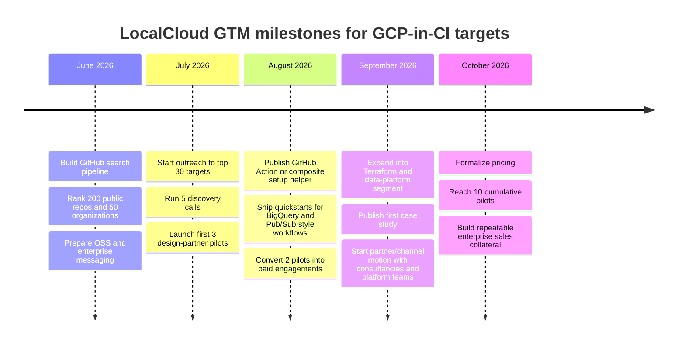

# LocalCloud GTM Report for GCP in CI and Public GitHub Prospecting

## Executive summary

The strongest initial market for LocalCloud is not “all GCP users.” It is the subset of teams whose CI pipelines already depend on live Google Cloud resources for integration tests, smoke tests, or deployment preparation, and whose code paths already align with Google’s environment-variable-driven emulator conventions or Application Default Credentials patterns. Public evidence from dbt Labs, Nextflow, Grafana, OpenDP SmartNoise, Two Bear Capital, Trino, and HashiCorp shows a recurring pattern: protected-branch-only tests, GitHub Actions jobs gated by secrets, Workload Identity Federation or service-account credentials, flaky or slow BigQuery-backed tests, and explicit documentation about the difficulty of running cloud-backed tests on fork PRs. That is exactly the wedge where LocalCloud can create immediate value by making more of those tests runnable on every PR without real-cloud credentials. citeturn14view2turn30view0turn25search7turn35view0turn37search0turn39search6turn29search2

The best-fit early customers are therefore: data-platform libraries and adapters that test against BigQuery, GCS, Pub/Sub, Firestore/Datastore, or Spanner; developer-tooling teams that run GCP-backed integration suites in GitHub Actions; and infra/platform teams whose Terraform or cloud-backed CI steps are blocked by credential requirements even when they only need pre-merge confidence rather than full control-plane validation. Repositories like `dbt-bigquery`, `smartnoise-sdk`, `tbc-bq-jdbc`, `nextflow`, and `trino` are especially interesting because they show both real cloud dependence and explicit pressure to separate “fast PR-safe tests” from “real cloud tests on main.” citeturn14view2turn35view0turn37search0turn30view0turn39search6

LocalCloud’s sharpest positioning should be: **replace credential-bound, flaky, or expensive GCP integration steps in PR CI with a single local container and env-var-based endpoint switching; keep a much smaller real-GCP smoke path only on `main` or nightly**. That message is reinforced by official GCP emulator behavior for Pub/Sub, Bigtable, Datastore, Firestore, and Spanner, all of which use stable environment-variable or emulator-host patterns that developers already recognize. citeturn41search0turn41search1turn42search9turn42search0turn42search3

The main product risk is the current lack of auth and role emulation. That means LocalCloud is best sold first as a **service-behavior emulator for application and integration tests**, not as a substitute for IAM, Workload Identity Federation, policy testing, or control-plane provisioning. Official GitHub and Google guidance around OIDC/WIF and ADC makes clear how much real CI still depends on token exchange and cloud identity, so outreach should explicitly narrow scope: “We help you move service-facing tests off live GCP; we do not yet replace your auth/IAM validation path.” citeturn6search11turn6search2turn41search19turn41search15

## Search strategy and exact GitHub patterns to run

The most effective research motion is a two-step pipeline. First, use GitHub code and workflow search to find hard evidence that a repo touches GCP in code or CI. Second, enrich the hits with repository metadata and activity signals from GitHub repository endpoints and repository activity/insight views such as statistics, contributors, commit graphs, and Pulse. GitHub’s search and repository tooling support this kind of qualifier-based narrowing and metadata enrichment. citeturn7view0turn5search1turn5search12turn5search13turn5search15turn5search6

A pragmatic default is to search public repositories with filters like `archived:false`, `fork:false`, `stars:>50`, and `pushed:>=2026-02-01`, then widen or narrow by topic and language. For design-partner prospecting, prioritize Python, Go, Java, TypeScript/JavaScript, Java/Kotlin build systems, and Terraform repos, because that is where Google Cloud client libraries, IaC providers, and Github Actions adoption are especially visible in public codebases. This is also where ADC and emulator-host conventions are common. citeturn41search19turn41search23turn41search0turn41search1turn42search9turn42search3

| Search objective | Exact GitHub query to run | Why it matters for LocalCloud |
|---|---|---|
| Find GitHub Actions using Google auth | `path:.github/workflows ("google-github-actions/auth" OR "google-github-actions/setup-gcloud" OR "google-github-actions/get-gke-credentials") language:YAML archived:false fork:false` | Direct evidence that CI is authenticating to or driving GCP |
| Find CLI-heavy GCP jobs | `path:.github/workflows ("gcloud " OR "bq " OR "gsutil " OR "gcloud auth configure-docker") language:YAML archived:false fork:false` | Finds jobs that likely hit live control plane or data plane |
| Find Terraform-bound GCP CI | `path:.github/workflows ("hashicorp/google" OR "provider \"google\"" OR "google-beta" OR "terraform plan") language:YAML archived:false fork:false` | Surfaces infra repos and app repos validating GCP infra in CI |
| Find service-account and ADC usage in CI | `path:.github/workflows ("GOOGLE_APPLICATION_CREDENTIALS" OR "GOOGLE_PROJECT_ID" OR "WORKLOAD_IDENTITY_PROVIDER" OR "service_account:" OR "credentials_json:") language:YAML archived:false fork:false` | Best signal for secret-bound CI pain |
| Find explicit emulator patterns | `("PUBSUB_EMULATOR_HOST" OR "BIGTABLE_EMULATOR_HOST" OR "FIRESTORE_EMULATOR_HOST" OR "DATASTORE_EMULATOR_HOST" OR "SPANNER_EMULATOR_HOST") archived:false fork:false` | Highest-fit repos because LocalCloud can plug into an existing mental model |
| Find BigQuery-heavy adapter/test repos | `(bigquery OR "google-cloud-bigquery" OR "@google-cloud/bigquery" OR "com.google.cloud:google-cloud-bigquery") stars:>20 pushed:>=2026-02-01 archived:false fork:false` | BigQuery is one of the clearest “real cloud in CI” segments |
| Find GCS/PubSub clients with integration tests | `("google-cloud-storage" OR "@google-cloud/storage" OR "google-cloud-pubsub" OR "@google-cloud/pubsub") ("integration" OR "e2e" OR "workflow") pushed:>=2026-02-01 archived:false fork:false` | Good targets for service-emulation pilots |
| Find non-GitHub-Actions CI | `path:.gitlab-ci.yml ("gcloud " OR "GOOGLE_APPLICATION_CREDENTIALS" OR "PUBSUB_EMULATOR_HOST")`  /  `path:Jenkinsfile ("gcloud " OR "GOOGLE_APPLICATION_CREDENTIALS")`  /  `path:.circleci/config.yml ("gcloud " OR "google-github-actions" OR "GOOGLE_APPLICATION_CREDENTIALS")` | Catches teams using GitLab, Jenkins, or CircleCI rather than Actions |

The file paths worth scanning first are:

```text
.github/workflows/*.yml
.github/workflows/*.yaml
.gitlab-ci.yml
.gitlab/**/*
Jenkinsfile
**/Jenkinsfile
.circleci/config.yml
terraform/**/*.tf
infra/**/*.tf
deploy/**/*.tf
scripts/**/*
Makefile
Taskfile.yml
docker-compose*.yml
compose*.yml
```

The code and dependency keywords worth running, by ecosystem, are:

```text
Python:
  google.cloud
  google-cloud-bigquery
  google-cloud-storage
  google-cloud-pubsub
  google-cloud-firestore
  google-cloud-spanner
  google.auth
  vertexai
  pubsub_v1
  storage.Client(
  bigquery.Client(

Node.js:
  @google-cloud/
  @google-cloud/bigquery
  @google-cloud/storage
  @google-cloud/pubsub
  @google-cloud/firestore
  @google-cloud/spanner
  google-auth-library

Go:
  cloud.google.com/go/
  cloud.google.com/go/bigquery
  cloud.google.com/go/storage
  cloud.google.com/go/pubsub
  cloud.google.com/go/firestore
  cloud.google.com/go/spanner
  google.golang.org/api/option

Java and Kotlin:
  com.google.cloud:
  com.google.auth
  google-cloud-bigquery
  google-cloud-storage
  google-cloud-pubsub
  google-cloud-firestore
  google-cloud-spanner

C#:
  Google.Cloud.
  Google.Apis.Auth

Terraform:
  provider "google"
  provider "google-beta"
  source = "hashicorp/google"
  google_
```

For LocalCloud specifically, add an **emulator-adjacent search lane**. Official Google emulator docs show that several services switch through stable env vars such as `PUBSUB_EMULATOR_HOST`, `BIGTABLE_EMULATOR_HOST`, `DATASTORE_EMULATOR_HOST`, and `SPANNER_EMULATOR_HOST`, while Firestore uses the Firestore emulator connection model and associated emulator host configuration. Those repos are disproportionately attractive because they already accept the idea that CI can redirect from cloud to local endpoints. citeturn41search0turn41search1turn42search9turn42search3turn42search0turn42search14

Use these exact queries as an emulator-adjacency slice:

```text
("PUBSUB_EMULATOR_HOST" OR "BIGTABLE_EMULATOR_HOST" OR "DATASTORE_EMULATOR_HOST" OR "SPANNER_EMULATOR_HOST" OR "FIRESTORE_EMULATOR_HOST") stars:>10 archived:false fork:false

path:.github/workflows ("PUBSUB_EMULATOR_HOST" OR "SPANNER_EMULATOR_HOST" OR "DATASTORE_EMULATOR_HOST") language:YAML

("act pull_request" AND ".github/workflows/bigquery.yml")
("integration tests" AND "BigQuery" AND ("auth@v2" OR "auth@v3"))
```

Finally, use a simple enrichment pass per hit:

```text
Repo metadata:
  stars, forks, pushed_at, default_branch, archived, org/user

Activity:
  workflow runs/week
  commit activity (past 90 days)
  contributors
  Pulse activity
  release cadence

Cloud evidence:
  number of unique GCP services touched
  credential patterns used
  emulator vars already present
  Terraform provider usage
```

## CI detection heuristics and workflow signatures to match

The single best heuristic for “GCP is in CI” is **credential setup immediately followed by cloud CLI or integration-test execution**. Official GitHub documentation for OIDC into Google Cloud and Google’s own `google-github-actions/auth` action establish the canonical pattern: `permissions: id-token: write`, then `google-github-actions/auth`, then cloud-facing steps. citeturn6search11turn6search2

In GitHub Actions, the highest-confidence matches are these signatures:

```yaml
permissions:
  contents: read
  id-token: write

steps:
  - uses: actions/checkout@v4
  - uses: google-github-actions/auth@v3
    with:
      workload_identity_provider: ${{ secrets.GOOGLE_WORKLOAD_IDENTITY_PROVIDER }}
      service_account: ${{ secrets.GOOGLE_SERVICE_ACCOUNT }}
  - uses: google-github-actions/setup-gcloud@v3
  - run: gcloud auth configure-docker us-central1-docker.pkg.dev
```

```yaml
steps:
  - uses: actions/checkout@v4
  - name: Run integration tests
    env:
      BIGQUERY_TEST_SERVICE_ACCOUNT_JSON: ${{ secrets.BIGQUERY_TEST_SERVICE_ACCOUNT_JSON }}
      GCS_BUCKET: my-ci-bucket
      DATAPROC_CLUSTER_NAME: ci-cluster
    run: tox -- --ddtrace
```

```yaml
steps:
  - uses: actions/checkout@v4
  - uses: google-github-actions/auth@v3
    with:
      credentials_json: ${{ secrets.GCP_SA_KEY }}
  - run: ./scripts/load-bigquery.bash update
```

Those are not hypothetical patterns. Public repos show them directly. `dbt-bigquery` injects `BIGQUERY_TEST_SERVICE_ACCOUNT_JSON`, alternate datasets, Dataproc config, and `GCS_BUCKET` into an integration workflow. `nextflow` shows the `auth@v3` plus `id-token: write` pattern for running the `google_batch` executor in Actions. Grafana workflows show WIF plus `setup-gcloud`, including installation of the `bq` component. Grafana Pathfinder uses `auth@v3` and a BigQuery-loading script. citeturn14view2turn30view0turn25search7turn25search14turn25search1

A second high-value heuristic is **ADC fallback**. Official Google docs say client libraries rely on Application Default Credentials, and `gcloud auth application-default login` writes credentials into a well-known location. Repos or issues that mention `GOOGLE_APPLICATION_CREDENTIALS`, ADC, or `application-default login` are excellent LocalCloud targets because they are already structured around environment-based runtime configuration. citeturn41search19turn41search23turn41search3turn41search15

The exact strings to match are:

```text
GOOGLE_APPLICATION_CREDENTIALS
gcloud auth application-default login
gcloud auth login --cred-file
create_credentials_file: true
export_environment_variables: true
credentials_json:
workload_identity_provider:
service_account:
GOOGLE_PROJECT_ID
GOOGLE_REGION
GOOGLE_BUCKET_NAME
BQ_TEST_PROJECT
BQ_TEST_DATASET
```

The third high-value heuristic is **branch-gated real-cloud tests**. This is common in public OSS because secrets are withheld from fork PRs. Two Bear Capital’s BigQuery JDBC docs explicitly explain that emulator tests run on every PR, but real BigQuery tests run only on pushes to `main` via WIF secrets; SmartNoise documents that its BigQuery workflow skips cleanly when required secrets are missing and can be run locally with `act` using a secret file. These are ideal design-partner leads because they have already separated “fast local-ish path” from “real cloud path,” which means LocalCloud can slot in as the default PR path without changing their overall CI strategy. citeturn37search0turn35view0

For GitLab CI, Jenkins, and CircleCI, use filename-plus-command heuristics rather than vendor-specific plugins as the first pass:

```yaml
# .gitlab-ci.yml heuristic
image: google/cloud-sdk:slim
script:
  - gcloud auth application-default login --quiet || true
  - pytest -m gcp
```

```groovy
// Jenkinsfile heuristic
pipeline {
  stages {
    stage('test') {
      steps {
        sh 'gcloud auth configure-docker'
        sh 'pytest -m integration'
      }
    }
  }
}
```

```yaml
# .circleci/config.yml heuristic
jobs:
  test:
    docker:
      - image: cimg/python:3.12
    steps:
      - checkout
      - run: gcloud auth configure-docker
      - run: pytest -m bigquery
```

The exact strings to grep for across those CI systems are:

```text
gcloud
bq
gsutil
firebase emulators:exec
GOOGLE_APPLICATION_CREDENTIALS
GOOGLE_PROJECT_ID
BIGQUERY_TEST_
PUBSUB_EMULATOR_HOST
SPANNER_EMULATOR_HOST
DATASTORE_EMULATOR_HOST
FIRESTORE_EMULATOR_HOST
provider "google"
hashicorp/google
terraform plan
terraform apply
get-gke-credentials
auth@v2
auth@v3
```

## Prioritization model and scoring table

The right outreach list should not be a popularity contest. It should rank repos and organizations by **pain**, **fit**, and **commercial leverage**.

I recommend a 100-point model with explicit penalties:

| Criterion | Weight | How to score it | Why it matters |
|---|---:|---|---|
| Confirmed GCP use in CI | 20 | 0 = code only; 10 = deploy only; 20 = test or validation job clearly hits GCP | Strongest proof of near-term pain |
| CI frequency and branch coverage | 15 | Count workflow runs, scheduled jobs, PR gates, matrix size | Higher run volume means larger time and cost savings |
| Test-surface breadth | 10 | Unit only vs integration/e2e vs multi-service | Multi-service suites benefit more from local emulation |
| Emulator alignment | 15 | High if repo uses BigQuery/GCS/Pub/Sub/Firestore/Datastore/Spanner-style clients or emulator env vars | Best technical fit for LocalCloud |
| Credential pain signal | 10 | WIF/ADC issues, fork-secret restrictions, “run only on main,” auth workarounds | Indicates immediate buying motivation |
| Organization leverage | 10 | OSS maintainer backed by company/foundation, likely private repo estate, multiple repos | Better expansion potential after initial win |
| Repo maturity | 5 | Stars, active contributors, recent pushes, release cadence | Ensures active maintenance |
| Buyer proximity | 10 | Platform engineering, QA, developer productivity, SRE, data platform team clearly identifiable | Easier GTM routing |
| OSS-to-private expansion potential | 5 | Does public OSS likely mirror internal enterprise repos? | Strong ROI multiplier |
| Auth and IAM dependency penalty | -10 | Subtract up to 10 if workflow value is mostly auth/roles/IAM/policy or control-plane only | LocalCloud does not currently emulate auth/roles |
| Unsupported-service / control-plane penalty | -10 | Subtract up to 10 if repo depends mainly on GKE, Artifact Registry, IAM, or provider acceptance tests for non-emulated control plane | Prevents mis-prioritization |

A simple formula is:

```text
Target Score =
  GCP-in-CI
+ CI frequency
+ test breadth
+ emulator alignment
+ credential pain
+ org leverage
+ repo maturity
+ buyer proximity
+ OSS/private expansion
- auth/IAM penalty
- unsupported-service penalty
```

Interpretation:

| Score band | Meaning | Recommended action |
|---|---|---|
| 80–100 | Immediate outreach | Offer design partner / pilot within 2 weeks |
| 65–79 | Strong candidate | Add to active outbound and qualify with light research |
| 50–64 | Monitor / nurture | Reach out only if there is clear maintainer/company context |
| Below 50 | Low current fit | Revisit after auth/role roadmap expands |

This ranking model is intentionally biased toward repos where cloud-backed CI is visible and expensive, but where tests could plausibly move to a local container. Public patterns from `dbt-bigquery`, `smartnoise-sdk`, `tbc-bq-jdbc`, `nextflow`, and `trino` justify that weighting much more than pure deployment-only repos or GKE-heavy infra validation suites. citeturn14view2turn35view0turn37search0turn30view0turn39search6

## Outreach and GTM plan

The GTM motion should start with a narrow wedge:

**Primary wedge:** teams running GCP-backed integration tests in PR CI or on `main`, especially BigQuery-heavy repos and developer tools that already document emulator-or-real-cloud splits.

**Secondary wedge:** Terraform and platform teams that have credential pain in CI, but only where the value proposition is pre-merge confidence and local service behavior, not IAM/policy validation.

**Tertiary wedge:** observability/platform teams using BigQuery or GCS in CI for data movement, changelog validation, or test fixtures.

The most effective value propositions are:

| Persona | Core message | Evidence pattern to cite in outreach |
|---|---|---|
| OSS maintainer | “Run more GCP integration checks on fork PRs, not only on protected branches.” | Fork-secret restrictions, branch-gated cloud tests, auth workarounds |
| Data-platform engineer | “Replace slow, flaky, costly real-cloud adapter tests with a local service container for PRs.” | BigQuery test duration, flaky cloud-backed tests, emulator split docs |
| Dev productivity / SRE | “Reduce CI duration, credentials surface area, and cloud spend without forcing code changes.” | ADC/env-var patterns, existing emulator-host usage, real-cloud-only-on-main patterns |
| Platform / infra team | “Keep one real-GCP smoke lane, move the rest off live cloud.” | Terraform/ADC complaints, WIF complexity, protected-branch-only tests |

Recommended pilot structure:

| Pilot phase | Duration | Deliverable |
|---|---:|---|
| Discovery | 1 week | Service map, top 2 failing/slow GCP-backed jobs, auth/IAM exclusions |
| Integration | 1 week | LocalCloud sidecar container in CI plus env-var swap for the target workflow |
| Parallel validation | 1 week | Run LocalCloud path and live-cloud path side by side on the same PRs |
| Rollout decision | 1 week | Decide PR default, `main` smoke retention, and paid conversion |

Recommended pilot success metrics:

| Metric | Target |
|---|---:|
| PR jobs that no longer require GCP secrets | 50%+ of targeted cloud-backed jobs |
| Median CI time for targeted workflow | 30–70% reduction |
| Flake rate on targeted job | 50%+ reduction |
| Real-GCP invocations on PRs | Near zero for the targeted workflow |
| Cloud spend for targeted test lane | Measurable reduction |
| Onboarding effort | Same day to under 3 days |

Recommended pricing and incentives:

| Offer | Suggested structure |
|---|---|
| OSS design partner | Free or heavily discounted 2–4 week pilot in exchange for detailed feedback and optionally a public case study |
| Startup / growth team | Fixed-fee pilot, then seat or CI-minute package |
| Enterprise platform team | Paid pilot with rollback support, success review, and installation help |
| Incentive lever | Discount for allowing anonymous benchmark data or a named case study |

A good maintainer message is short and specific:

> We noticed your repo runs cloud-backed GCP checks in CI and appears to gate some of them behind real credentials or protected branches. LocalCloud can run a local emulator container for multiple GCP services with env-var-only setup, so PRs can exercise more of that path without live GCP. We would scope this only to service-behavior tests and leave IAM/auth validation on your existing `main` or nightly path.

A stronger version for a company-backed OSS team:

> Your public repo suggests a split between PR-safe tests and real-GCP tests on `main`. We think LocalCloud can make the PR lane much closer to production behavior while removing most secret requirements. If helpful, we can map one workflow, keep one live-cloud smoke job, and measure runtime, flake rate, and credentials eliminated.

Recommended channels:

- Maintainer email or GitHub Discussions for OSS projects with visible CI pain.
- Issues or PR comments only when the repo already documents CI/auth pain and the outreach is helpful rather than promotional.
- Developer productivity, platform engineering, SRE, and QA leaders at companies behind public repos.
- Communities near the highest-fit segments: dbt, data tooling, Trino/Presto, GitHub Actions, Terraform, platform engineering, and observability teams.
- Partnership motion with platform consultancies, self-hosted runner vendors, and teams that publish reusable GitHub Action workflows around GCP.

The best partnership ideas are:

- **GitHub Actions examples and wrappers:** publish a LocalCloud setup action or composite action.
- **Terraform module maintainers:** provide “CI local mode” examples for modules that currently require real GCP.
- **Data tooling maintainers:** co-develop “PR local / main real” test templates for BigQuery-backed adapters.
- **Developer productivity consultancies:** package LocalCloud as a CI cost-and-flake reduction service.

## Privacy, legal, and product risk considerations

LocalCloud should be framed as a **test-environment product**, not as a permission, identity, or compliance simulator. Google’s auth model for client libraries and GitHub-to-GCP OIDC workflows is built around ADC, access-token exchange, and cloud identity. That makes the current “no auth/roles emulation” limitation important and worth stating early. Official docs show that GitHub Actions OIDC to GCP relies on token exchange via `google-github-actions/auth`, and Google client libraries rely on ADC resolution. citeturn6search11turn6search2turn41search19turn41search3

That yields a clean product-boundary message:

- LocalCloud is for **service-facing application behavior, integration tests, local and CI execution**.
- It is **not yet** a substitute for:
  - IAM policy validation
  - Workload Identity Federation validation
  - role-based authorization tests
  - cloud control-plane provisioning correctness
  - end-to-end auth token exchange or signed identity flows

That message is supported by public repo behavior. `nextflow` needed an explicit auth workaround around `GOOGLE_APPLICATION_CREDENTIALS` and `gcloud auth login --cred-file`; Grafana and SmartNoise document WIF or service-account-based cloud auth in CI; Two Bear Capital documents WIF-backed real BigQuery tests on `main`. All of that is real-cloud identity logic, not just service behavior. citeturn30view0turn25search7turn35view0turn37search0

Recommended mitigation language for sales and support:

> LocalCloud is best used to remove live-GCP dependence from PR-time service tests. Keep your current auth/IAM smoke tests on `main`, nightly, or pre-release until you explicitly decide to shrink them. We do not ask you to replace your security validation path on day one.

Privacy and legal recommendations:

| Risk | Guidance |
|---|---|
| Production data leakage into local CI | Require synthetic or anonymized fixtures by default |
| Secret overexposure | Prefer LocalCloud PR jobs with no GCP secrets; keep WIF or service-account secrets only in the reduced real-cloud lane |
| Auditability | Offer clear logs of which services are emulated and which calls remain real-cloud |
| Security expectations mismatch | Contractually and in docs distinguish “service emulation” from “auth/roles emulation” |
| Test false confidence | Encourage one reduced real-cloud smoke lane on `main` or release branches |

An especially effective mitigation strategy mirrors what strong public repos already do: keep a small real-cloud lane for protected branches while shifting most PR validation to local or emulator-backed tests. `tbc-bq-jdbc` and `smartnoise-sdk` both already describe exactly that structure. citeturn37search0turn35view0

## Sample public outreach list, next steps, and timeline

The table below is a **sample first-pass outreach list**, prioritized by visible GCP-in-CI evidence and LocalCloud fit. It is intentionally skewed toward public repos that expose likely pain, not necessarily the absolute largest organizations.

| Repo | Why it matched | Matching CI snippet or file path | Pilot fit |
|---|---|---|---|
| [dbt-labs/dbt-bigquery](https://github.com/dbt-labs/dbt-bigquery) | Strongest public example of cloud-backed adapter tests in Actions. The integration workflow injects BigQuery credentials plus Dataproc and GCS state, and the repo has an issue explicitly discussing dedicated GCP projects for CI. citeturn14view2turn9search2 | `.github/workflows/integration.yml`; env includes `BIGQUERY_TEST_SERVICE_ACCOUNT_JSON`, `DATAPROC_CLUSTER_NAME`, `GCS_BUCKET`. citeturn13view0turn14view2 | High |
| [nextflow-io/nextflow](https://github.com/nextflow-io/nextflow) | Clear GitHub Actions + GCP Batch evidence. Public issue shows `google_batch` executor running in Actions with `google-github-actions/auth@v3`, GCS work bucket, and an auth workaround. citeturn30view0 | `.github/workflows/run_reproducer.yml`; `permissions: id-token: write`; `uses: "google-github-actions/auth@v3"`; `./nextflow run ... -profile google_batch -w <storage-bucket>`. citeturn30view0 | High |
| [grafana/grafana](https://github.com/grafana/grafana) | Public workflow snippets show OIDC/WIF into GCP and setup of the Cloud SDK with the `bq` component in the core repo, indicating BigQuery-backed CI checks. citeturn25search7turn25search14 | `.github/workflows/detect-breaking-changes-levitate.yml`; `google-github-actions/setup-gcloud`; `project_id: 'grafanalabs-global'`; `install_components: 'bq'`. citeturn25search7turn25search14 | Medium-high |
| [grafana/grafana-pathfinder-app](https://github.com/grafana/grafana-pathfinder-app) | Very explicit BigQuery workflow. Public file snippet shows auth action plus a script that loads data into BigQuery. citeturn25search1turn25search10 | `.github/workflows/load-bigquery.yml`; `uses: google-github-actions/auth@v3`; `run: ./scripts/load-bigquery.bash update`. citeturn25search1 | High |
| [grafana/grafana-bench](https://github.com/grafana/grafana-bench) | Workflow-run errors show cloud-auth dependence in CI against Grafana Labs WIF service accounts. That is strong pain, though lower LocalCloud fit unless the workflow also exercises emulatable services. citeturn25search6turn25search12turn25search15 | Workflow runs show `google-github-actions/auth failed` for `publish-dev-base` and `publish-dev-playwright` with a GCP service account. citeturn25search6turn25search12 | Medium |
| [opendp/smartnoise-sdk](https://github.com/opendp/smartnoise-sdk) | Excellent LocalCloud-shaped target. The repo documents `GCP BigQuery Integration Tests`, WIF or service-account auth, secrets gating, and local execution with `act`. citeturn35view0turn37search2 | `.github/workflows/bigquery.yml`; secrets include `GOOGLE_PROJECT_ID`, `GOOGLE_REGION`, `GOOGLE_BUCKET_NAME`, WIF provider/service account or `GOOGLE_APPLICATION_CREDENTIALS`. citeturn35view0 | High |
| [Two-Bear-Capital/tbc-bq-jdbc](https://github.com/Two-Bear-Capital/tbc-bq-jdbc) | Nearly ideal design partner. The project already splits emulator tests from real BigQuery tests and uses WIF secrets only on `main`. That is LocalCloud’s exact entry point. citeturn37search0 | `docs/INTEGRATION_TESTS.md` points to `.github/workflows/build.yml`; PR path runs emulator tests, `main` path runs real BigQuery tests via `google-github-actions/auth@v2`. citeturn37search0 | Very high |
| [hashicorp/terraform-provider-google](https://github.com/hashicorp/terraform-provider-google) | Major infrastructure prospect. Public issue shows CI-provider pain where `terraform plan` still fails because the provider attempts ADC even when real credentials should not be needed. citeturn29search2turn29search1 | Issue #19546 snippet references running `terraform plan` in CI with no creds and workaround via dummy `GOOGLE_APPLICATION_CREDENTIALS`. citeturn29search2 | Medium-high |
| [trinodb/trino](https://github.com/trinodb/trino) | Trino has explicit BigQuery CI lanes and public issues about BigQuery test duration and flakiness, making it a strong “cost + flake + PR confidence” target. citeturn40view0turn39search6turn39search8turn39search4 | Actions run title references `tests-bq-ci` / “BigQuery CI”; issues cite `TestBigQueryAvroConnectorTest` taking ~50 minutes and flaky BigQuery failures. citeturn40view0turn39search6turn39search8 | High |
| [PRQL/prql](https://github.com/PRQL/prql) | Early-stage but high-signal lead. Public issue asks for BigQuery integration tests and specifically calls out auth-token setup and CI cost questions. citeturn37search1 | Issue #872, “BigQuery integration tests,” discusses auth token needs, cost, and easy local setup. citeturn37search1 | Medium-high |
| [fluent/fluent-bit-ci](https://github.com/fluent/fluent-bit-ci) | Visible GCP-heavy CI with Terraform and GKE. Strong proof of cloud-backed CI usage, though fit is lower if the value is mostly around cluster/control-plane workflows rather than emulatable services. citeturn38search0 | `.github/workflows/call-run-integration-test.yaml`; `google-github-actions/auth@v2`, `setup-gcloud@v2`, Terraform setup, `get-gke-credentials@v2`. citeturn38search0 | Medium |
| [prestodb/presto](https://github.com/prestodb/presto) | Public Actions annotations show BigQuery connector-related tests running in CI. Good fit if the team is feeling the same flake/runtime pain as Trino. citeturn39search1 | Actions annotations mention `TestBigQueryConnectorModule` and `TestReadRowsHelper` under GitHub Actions test runs. citeturn39search1 | Medium |

Recommended next steps for the next 30 days:

| Week | What to do | Output |
|---|---|---|
| Week one | Build a repeatable GitHub search sheet using the exact queries above; collect 150–250 repos and 50–75 orgs | Initial prospect database |
| Week two | Score all prospects with the model above; separate into High / Medium / Low fit | Ranked outreach list |
| Week three | Start outbound to 20–30 highest-fit OSS/company-backed repos | 8–12 discovery conversations |
| Week four | Launch 2–4 pilots focused on one workflow each | Design-partner cohort |

Recommended product packaging for those pilots:

- **PR-local lane**: LocalCloud on every PR, no cloud creds, fast fail.
- **Protected-branch smoke lane**: keep one real-GCP run on `main` or nightly.
- **Migration worksheet**: list every environment variable, service, expected behavior, and remaining real-cloud dependency.
- **Proof points**: before/after CI runtime, cloud spend, flake rate, number of secrets removed, and number of workflows newly runnable on forks.

The following timeline is the recommended GTM milestone plan:



**Open questions and limitations:** this report is strongest on public GitHub evidence and on repos where GCP-in-CI is visible in workflows, issues, or CI documentation. It is weaker for private enterprise teams whose public repos do not expose CI, and for repos where GCP usage is mostly hidden behind internal reusable workflows. That is why the recommended motion starts with public OSS signals and then expands into company-backed private estates once one team validates the PR-local plus `main`-smoke pattern.