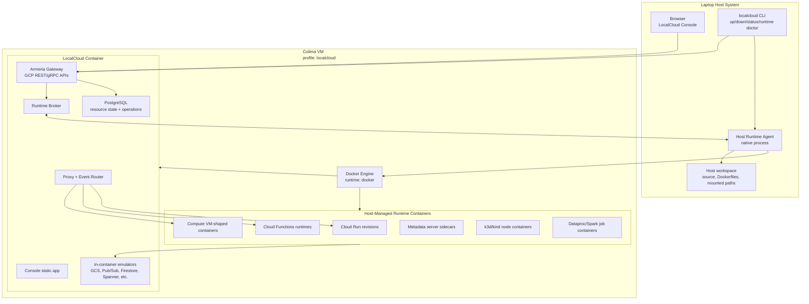
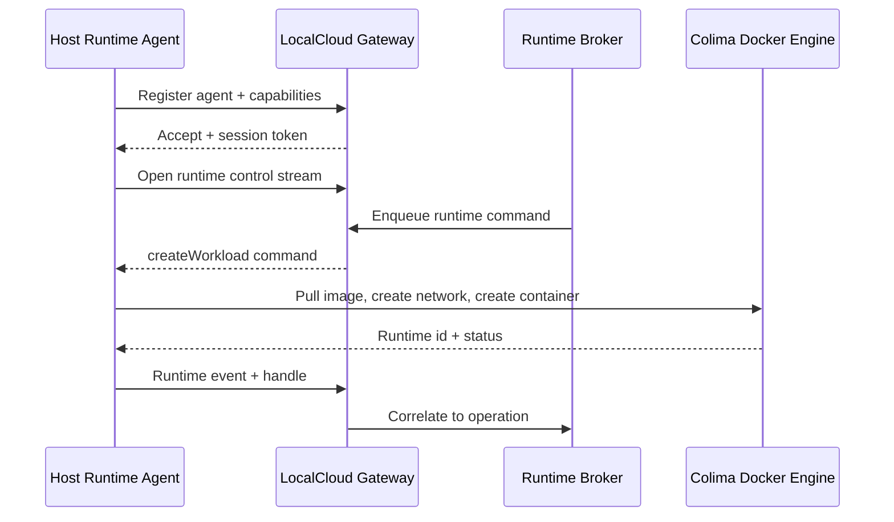
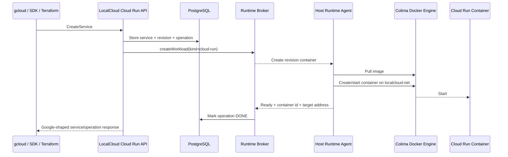
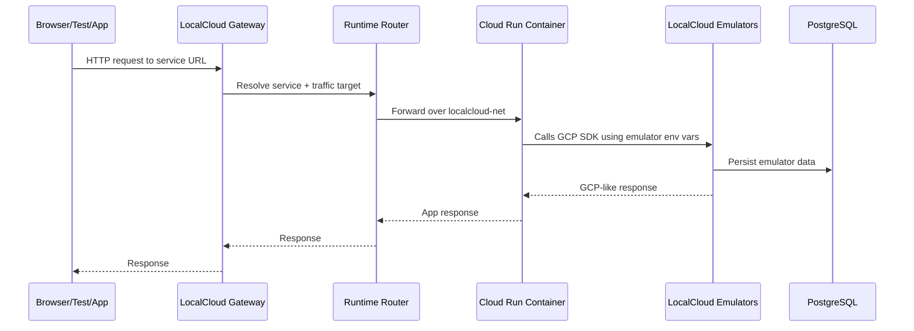
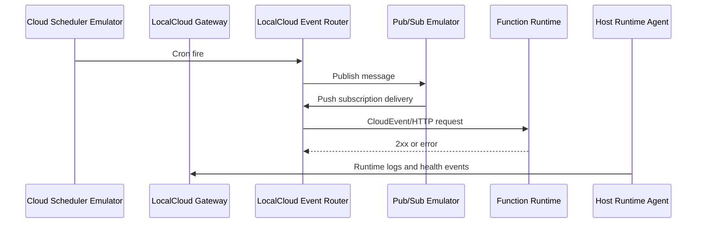
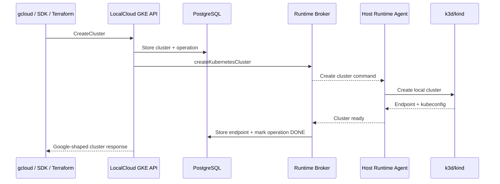

# Colima Host Runtime Architecture Proposal

Status: Proposed
Date: 2026-06-02
Document type: Architecture explanation and implementation proposal
Audience: LocalCloud maintainers and implementation agents

## Summary

LocalCloud should split compute-heavy emulation into two planes:

- The **LocalCloud Docker container** remains the Google-compatible control plane. It owns REST/gRPC APIs, resource state, operations, routing, console APIs, event dispatch, emulator data, and compatibility behavior.
- A **host runtime agent** runs on the developer laptop and owns execution. It starts and manages lightweight runtime components through Colima, Docker, k3d/kind, and host process adapters.

This lets LocalCloud expose Google Cloud APIs while creating actual Cloud Run services, Cloud Functions runtimes, Compute VM-shaped containers, GKE clusters, and Dataproc jobs as sibling workloads on the laptop. It avoids Docker-in-Docker and keeps the LocalCloud image clean.

The preferred runtime should be **Colima with Docker runtime**, using a dedicated `localcloud` profile. Colima gives a lightweight local Linux VM with Docker-compatible behavior on macOS and Linux. The host agent then uses the Docker Engine API, Docker context, and optimized components such as k3d/kind and Spark local containers where they provide real compliance at low cost.

## Goals

- Let users manage host-side runtime workloads from the LocalCloud console.
- Keep GCP SDK, gcloud, and Terraform compatibility centered on LocalCloud APIs.
- Use lightweight but real execution engines instead of toy reimplementations.
- Avoid privileged Docker-in-Docker inside the LocalCloud container.
- Support many small runtime workloads on a laptop without requiring cloud access.
- Keep runtime behavior observable through LocalCloud: logs, status, URLs, operations, errors, and cleanup.
- Allow metadata-only fallback when the host agent is not installed or not running.

## Non-Goals

- Do not reproduce Google production scheduling, autoscaling, VPC, IAM, or fleet behavior exactly.
- Do not make LocalCloud a general-purpose container orchestration product.
- Do not let the browser talk directly to Docker, Colima, or the host agent.
- Do not require Docker Desktop.
- Do not require users to mount the host Docker socket into the LocalCloud container for the default path.

## Design Principle

Emulate what developers and client libraries observe.

For compute services, that means:

- The Google API surface must be high fidelity.
- Resource names, lifecycle states, operations, errors, pagination, labels, update masks, and basic validation must look Google-like.
- Workloads should actually execute when developers depend on side effects.
- Production-only infrastructure fields can be stored, translated, or rejected with clear compatibility behavior.

## High-Level Decision

Use a **host-initiated runtime channel**.

The host runtime agent connects outward to LocalCloud and keeps a bidirectional control stream open. LocalCloud sends runtime commands over this channel. The agent sends back runtime events, logs, health, port mappings, and operation status.

This avoids fragile container-to-host networking. It also keeps the console simple: the console only talks to LocalCloud.

## Deployment Topology



## Process Distribution

| Location | Processes |
| --- | --- |
| Laptop host | `localcloud` CLI, host runtime agent, browser, optional developer-run source servers, optional Functions Framework |
| Colima VM | Docker Engine, Docker networks, Docker volumes, LocalCloud container, runtime workload containers |
| LocalCloud container | Armeria gateway, Google-compatible APIs, console static server, PostgreSQL, runtime broker, service/event router, lightweight dispatchers, in-container emulators |
| Runtime containers | Cloud Run revisions, Cloud Functions runtimes, Compute VM-shaped containers, metadata sidecars, k3d/kind nodes, Dataproc/Spark jobs |
| k3d/kind clusters | Kubernetes workloads deployed through GKE-compatible flows |

## Runtime Stack

### Preferred Stack

```bash
colima start --profile localcloud --cpus 4 --memory 8 --disk 100 --runtime docker
```

Use this as the default shape:

- Colima profile: `localcloud`
- Runtime: Docker
- Docker context: Colima-managed context for the `localcloud` profile
- Kubernetes: disabled by default for the Colima profile
- GKE: managed by k3d or kind on top of the Colima Docker Engine

Colima can start with Kubernetes enabled, but LocalCloud should not use Colima's built-in Kubernetes as the default GKE implementation. GKE emulation needs API-created clusters, node pools, kubeconfig generation, lifecycle operations, and multiple cluster support. k3d or kind gives LocalCloud better per-cluster control while still using the lightweight Colima Docker runtime.

### Optional Colima Kubernetes Mode

```bash
colima start --profile localcloud --cpus 4 --memory 8 --disk 100 --runtime docker --kubernetes
```

This can be supported as an advanced mode for users who want a single local Kubernetes cluster, but it should not be the default for GKE API compatibility.

### Runtime Components

| Need | Preferred Component | Reason |
| --- | --- | --- |
| Linux VM for local containers | Colima | Lightweight, Docker-compatible, good default for macOS and Linux |
| Container runtime | Docker Engine through Colima | Docker Engine API supports image pull, container lifecycle, logs, exec, ports, networks, labels, mounts, health checks, and resource limits |
| GKE-like Kubernetes clusters | k3d or kind | Real Kubernetes behavior, cheap local clusters, controllable from host agent |
| Cloud Run and Functions execution | Docker containers | OCI image behavior matches developer expectations |
| Compute VM approximation | Long-running Docker containers plus metadata sidecars | Gives startup scripts, metadata, disks, ports, and OS-image approximation without hypervisors |
| Dataproc execution | Spark container or host process adapter | Real Spark behavior without a full Hadoop cluster |
| Event delivery | LocalCloud event router | Keeps Pub/Sub, Scheduler, Tasks, Functions, and Run connected through LocalCloud state |

## Component Details

### LocalCloud Gateway

The gateway continues to expose Google-compatible REST and gRPC APIs.

Responsibilities:

- Accept SDK, gcloud, Terraform, and console requests.
- Validate resource names, parent paths, update masks, and request shapes.
- Create long-running operations where Google APIs use them.
- Store desired state in PostgreSQL.
- Return Google-shaped responses.
- Avoid blocking API calls on long runtime work when Google would return an operation.

### Runtime Broker

The runtime broker is the LocalCloud-side abstraction between service emulators and execution.

Responsibilities:

- Convert service-specific desired state into runtime-neutral commands.
- Track runtime operations and correlate them to Google operations.
- Send commands to the connected host agent.
- Receive runtime status, health, ports, logs, and errors.
- Reconcile desired state with actual runtime state after restart.
- Fail gracefully into metadata-only mode when no agent is available.

Proposed interface:

```java
interface RuntimeProvider {
    RuntimeOperation createWorkload(WorkloadSpec spec);
    RuntimeOperation startWorkload(String workloadId);
    RuntimeOperation stopWorkload(String workloadId);
    RuntimeOperation deleteWorkload(String workloadId);
    RuntimeInspection inspectWorkload(String workloadId);
    RuntimeLogStream streamLogs(String workloadId, LogQuery query);
    RuntimeExecSession exec(String workloadId, ExecRequest request);
    RuntimeOperation ensureNetwork(NetworkSpec spec);
    RuntimeOperation ensureVolume(VolumeSpec spec);
    RuntimeOperation createKubernetesCluster(KubernetesClusterSpec spec);
    RuntimeOperation deleteKubernetesCluster(String clusterId);
}
```

Implementations:

- `HostAgentRuntimeProvider`: default full runtime mode.
- `NoopRuntimeProvider`: metadata-only mode.
- `DockerSocketRuntimeProvider`: optional escape hatch for advanced users.
- `TestRuntimeProvider`: deterministic unit/integration tests.

### Host Runtime Agent

The host runtime agent is a small native process. Go is a strong fit because it has mature Docker, process, filesystem, and cross-platform packaging support.

Responsibilities:

- Ensure or discover the Colima `localcloud` profile.
- Discover Docker context/socket for the Colima profile.
- Create and manage Docker networks, volumes, containers, images, and port bindings.
- Manage k3d/kind clusters for GKE.
- Manage host process or container jobs for Dataproc.
- Stream logs and runtime events back to LocalCloud.
- Enforce ownership boundaries through labels and allowlists.
- Reattach to existing LocalCloud-managed workloads after restart.

Agent modules:

| Module | Responsibility |
| --- | --- |
| `AgentServer` | Maintains outbound control stream to LocalCloud |
| `AuthManager` | Handles pairing token, agent identity, and request authorization |
| `ColimaManager` | Starts, stops, inspects, and validates the `localcloud` Colima profile |
| `DockerRuntimeAdapter` | Uses Docker Engine API for images, containers, networks, volumes, logs, exec, and health |
| `KubernetesRuntimeAdapter` | Uses k3d/kind and kubectl-compatible kubeconfig handling |
| `ProcessRuntimeAdapter` | Runs local host processes or job containers for Dataproc-style workloads |
| `NetworkManager` | Creates `localcloud-net`, aliases, port mappings, and resolver metadata |
| `VolumeManager` | Creates named volumes and controlled bind mounts |
| `ImageManager` | Pulls, tags, and optionally builds images |
| `LogStreamer` | Streams stdout/stderr and structured runtime events |
| `MetadataSidecarManager` | Creates metadata server sidecars for Compute-like workloads |
| `Reconciler` | Re-discovers labeled resources and repairs drift |
| `Guardrails` | Enforces path allowlists, label ownership, and safe cleanup |

### Runtime Control Channel

Preferred: agent-initiated bidirectional stream.



Fallback: LocalCloud calls a loopback HTTP/gRPC endpoint exposed by the agent. This should be secondary because container-to-host addressing differs across runtimes.

### Runtime State Store

Add runtime-specific state tables in PostgreSQL. The service resources remain in their service-specific tables.

Suggested tables:

| Table | Purpose |
| --- | --- |
| `runtime_agents` | Connected agents, version, capabilities, profile, health |
| `runtime_workloads` | Mapping from Google resource to runtime id/container id/cluster id |
| `runtime_operations` | Runtime-side operation state correlated to Google operations |
| `runtime_events` | Recent lifecycle events, warnings, errors, health transitions |
| `runtime_networks` | Runtime network names, aliases, CIDRs, attached workloads |
| `runtime_ports` | Host ports, container ports, service URLs, proxy targets |
| `runtime_volumes` | Persistent disk and volume mappings |

Each runtime resource should carry labels:

```text
com.localcloud.managed=true
com.localcloud.project=<project-id>
com.localcloud.service=<cloud-run|functions|compute|gke|dataproc>
com.localcloud.resource=<google-resource-name>
com.localcloud.operation=<operation-id>
```

The labels are required for safe discovery and cleanup.

## Networking Model

Use a dedicated Docker network inside the Colima Docker Engine:

```text
localcloud-net
```

Network aliases:

| Alias | Target |
| --- | --- |
| `localcloud` | LocalCloud container |
| `run-<service>-<revision>` | Cloud Run revision container |
| `function-<name>` | Cloud Functions runtime container |
| `compute-<instance>` | Compute VM-shaped container |
| `metadata-<instance>` | Compute metadata sidecar |

Traffic paths:

- Host browser to console: host port `8080` to LocalCloud container.
- SDK/gcloud/Terraform to APIs: host port `8080` or service-specific emulator ports.
- LocalCloud to runtime workload: Docker network alias or runtime proxy target.
- Workload to emulators: `localcloud:<port>` inside `localcloud-net`.
- Event router to workload: LocalCloud router forwards to runtime target.
- Console to runtime logs: console calls LocalCloud; LocalCloud streams events received from agent.

Do not require users to know runtime container ports. The console should show Google-like URLs and debug URLs, but routing should go through LocalCloud wherever possible.

## API and Compatibility Model

Use four categories for each Google resource field:

| Category | Behavior |
| --- | --- |
| Enforced | LocalCloud validates and uses the field to drive runtime behavior |
| Translated | LocalCloud maps the field to a local equivalent |
| Stored | LocalCloud stores and returns the field, but does not enforce production behavior |
| Rejected | LocalCloud returns a clear error because the field would create misleading behavior |

Avoid silent ignores. If a field is stored-only, make that explicit in compatibility metadata and optionally expose a console warning.

Examples:

| Field Type | Example | Behavior |
| --- | --- | --- |
| Runtime image | Cloud Run container image | Enforced through Docker image pull/create |
| Env vars | Cloud Run, Functions, Compute startup env | Enforced |
| Memory/CPU | Cloud Run limits, Compute machine type | Translated to Docker resource limits where practical |
| Service account | Cloud Run/Compute service account | Stored plus fake token metadata |
| VPC connector | Cloud Run VPC connector | Stored or rejected depending on strictness mode |
| GKE node pool size | GKE node pool autoscaling/size | Translated to k3d/kind nodes where practical |
| Compute disk | Persistent disk attachment | Translated to Docker volume |
| IAM condition | IAM policy condition | Stored-only or rejected depending on existing IAM mode |

## Service-by-Service Runtime Mapping

### Cloud Run

Cloud Run should use Docker containers managed by the host agent.

LocalCloud owns:

- Services
- Revisions
- Jobs
- Executions
- Traffic
- Operations
- Service URLs
- Logs API shape
- Console state

Host agent owns:

- Image pull
- Container create/start/stop/delete
- Env vars and command/args
- Port binding
- Health check
- Resource limits
- Log streaming
- Runtime labels

Flow:



Cloud Run scale-to-zero can be approximated by stopping idle containers and restarting on first request. This should be an optional setting because restart latency is visible in local development.

### Cloud Functions Gen2

Cloud Functions Gen2 should be modeled as Cloud Run plus trigger wiring.

Modes:

- **Managed container mode**: LocalCloud builds or runs a function container through the host agent.
- **External endpoint mode**: The developer runs Functions Framework locally; LocalCloud routes HTTP and event triggers to that endpoint.

LocalCloud owns:

- Function resource shape
- Build config metadata
- Service config metadata
- Event trigger config
- Runtime list
- Upload URL behavior
- Trigger subscriptions
- Operations

Host agent owns:

- Optional source build
- Function container lifecycle
- Log streaming
- Local endpoint health

Trigger routing:

- Pub/Sub trigger creates a local Pub/Sub push subscription.
- Scheduler trigger dispatches through LocalCloud event router.
- Storage trigger uses LocalCloud's internal event bus.
- HTTP trigger proxies through LocalCloud to the function target.

### Compute Engine

Compute Engine should be implemented as VM-shaped containers.

LocalCloud owns:

- Instances
- Disks
- Network interfaces
- Metadata
- Tags
- Service accounts
- Machine types
- Zone operations
- Instance lifecycle states

Host agent owns:

- Long-running OS-like container
- Startup script execution
- Docker volumes for disks
- Metadata sidecar
- Port publishing
- Exec or SSH-like debug access
- Log streaming

Recommended image mapping:

| Compute image family | Local image |
| --- | --- |
| Debian | `debian:<version>` |
| Ubuntu | `ubuntu:<version>` |
| Container-Optimized OS | Small Docker host utility image or stored-only until a useful image exists |
| Rocky/RHEL-like | `rockylinux:<version>` or stored-only depending on availability |

Machine types should map to CPU/memory defaults, then translate to Docker resource limits. Exact performance is not required; visible limits and metadata should be consistent.

### GKE

GKE should use k3d or kind managed by the host agent against the Colima Docker Engine.

LocalCloud owns:

- Clusters
- Node pools
- Operations
- Kubernetes versions
- Cluster status
- Endpoint and kubeconfig response
- GKE-shaped errors and lifecycle states

Host agent owns:

- k3d/kind cluster creation
- Node container lifecycle
- kubeconfig extraction
- Network attachment
- Node count changes where supported

Why not Colima's built-in Kubernetes by default:

- It is useful as a single local Kubernetes cluster.
- GKE emulation needs API-created clusters and node pools.
- k3d/kind provides better cluster-per-resource isolation.
- LocalCloud can delete, recreate, and inspect clusters without mutating the user's default Kubernetes environment.

### Dataproc

Dataproc should execute real Spark jobs without creating a full production-like Hadoop cluster.

LocalCloud owns:

- Cluster metadata
- Job metadata
- Operations
- Job lifecycle states
- Logs API shape
- Staging bucket references

Host agent owns:

- Spark local container or host process execution
- Dependency staging
- Driver logs
- Exit status
- Cancellation

Prefer a Spark container image inside Colima over requiring host `SPARK_HOME`. Host `SPARK_HOME` can remain an advanced adapter.

### Cloud Tasks and Cloud Scheduler

Cloud Tasks and Cloud Scheduler can remain inside the LocalCloud container because they are lightweight dispatchers.

They should use the runtime resolver when targeting runtime workloads:

- Cloud Tasks HTTP target to Cloud Run service.
- Cloud Scheduler HTTP target to Cloud Run or Function.
- Scheduler Pub/Sub target to Pub/Sub emulator, then Function trigger.
- App Engine target stored or translated to a configured local endpoint.

## Console Experience

The console should treat host runtime execution as a first-class status surface.

Add a Runtime page:

- Agent status
- Colima profile status
- Docker context
- Runtime mode: full, metadata-only, docker-socket fallback
- Resource totals: containers, clusters, volumes, networks
- Warnings: missing Colima, stopped profile, stale containers, port conflicts
- Actions: start agent, run doctor, cleanup orphaned resources

Service pages should show runtime details:

- Cloud Run: active revision, container id, image, target port, logs, restart, stop, delete
- Functions: trigger bindings, runtime endpoint, logs, source/build status
- Compute: instance runtime id, metadata endpoint, disks, startup script logs, exec shell
- GKE: kubeconfig, node containers, node pool status, cluster endpoint
- Dataproc: job process/container, driver logs, exit code

Console requests must go to LocalCloud only. LocalCloud proxies or streams runtime details from the agent.

## Startup Flow

Recommended CLI behavior:

```bash
localcloud up
```

Steps:

1. Check for Colima.
2. Start or validate the `localcloud` Colima profile.
3. Start the host runtime agent.
4. Start the LocalCloud Docker container on the Colima Docker Engine.
5. Attach LocalCloud container to `localcloud-net`.
6. Agent registers with LocalCloud.
7. LocalCloud switches runtime mode to `full`.
8. Console becomes available.

Diagnostic command:

```bash
localcloud runtime doctor
```

Checks:

- Colima installed
- `localcloud` profile running
- Docker context reachable
- LocalCloud container reachable
- Agent connected
- Runtime network exists
- Required ports are available
- Runtime labels are discoverable

Metadata-only mode:

```bash
localcloud up --metadata-only
```

In this mode, LocalCloud accepts and stores resources but does not execute host workloads. The console should clearly show runtime execution as unavailable.

## Reconciliation

The system needs reconciliation because host processes and containers can be stopped outside LocalCloud.

Reconciliation loop:

1. LocalCloud stores desired resource state.
2. Agent periodically lists Colima Docker containers, networks, volumes, and k3d/kind clusters with LocalCloud labels.
3. Agent reports actual state.
4. Runtime broker compares desired and actual state.
5. Broker repairs safe drift or marks the resource degraded.
6. Console shows status and remediation actions.

Do not recreate deleted containers silently unless the corresponding Google resource state is still active and the service policy says it should be repaired.

## Failure Handling

| Failure | Expected Behavior |
| --- | --- |
| Agent disconnected | LocalCloud keeps APIs available, marks runtime mode degraded, blocks new execution operations or returns operation errors |
| Colima stopped | Agent reconnects after Colima restart or reports runtime unavailable |
| Container failed | Agent reports exit code and logs; LocalCloud updates service-specific state |
| Port conflict | Agent reports runtime operation error; LocalCloud returns failed operation |
| Image pull failure | Operation fails with image error details |
| LocalCloud restarted | Agent reconnects and reports actual runtime inventory |
| Agent restarted | Agent re-discovers labeled workloads and reattaches |
| Host reboot | CLI/agent restart reconciles expected resources against runtime inventory |

## Security Model

Default security posture:

- Agent listens on loopback only if it exposes a local endpoint.
- Preferred control channel is agent-initiated.
- Pairing token is generated by `localcloud up`.
- Agent only manages resources with LocalCloud labels.
- Cleanup only touches `com.localcloud.managed=true` resources.
- Bind mounts require explicit allowlist.
- Host filesystem access is denied by default except declared workspace paths.
- Browser never talks directly to agent, Docker, Colima, or k3d.
- Docker socket mount into LocalCloud is not the default path.

Optional advanced mode:

```bash
localcloud up --runtime docker-socket
```

This may mount Docker control into the LocalCloud container for users who explicitly accept the tradeoff. It should be documented as less isolated and not recommended for teams.

## Data Flow Examples

### User Request to Cloud Run Service



### Scheduler to Function



### GKE Cluster Creation



## Implementation Phases

### Phase 1: Runtime Foundation

- Add runtime broker abstraction in LocalCloud.
- Add runtime state tables.
- Add metadata-only provider.
- Add host agent skeleton.
- Add agent registration and capability reporting.
- Add runtime status to console.
- Add `localcloud runtime doctor`.

### Phase 2: Colima and Docker Runtime

- Implement `ColimaManager`.
- Implement Docker Engine adapter.
- Create `localcloud-net`.
- Add image pull, container create/start/stop/delete, inspect, logs, exec.
- Enforce labels and cleanup guardrails.
- Add runtime reconciliation.

### Phase 3: Cloud Run Execution

- Connect Cloud Run service/revision creation to runtime broker.
- Add runtime proxy targets.
- Add logs and container status to Cloud Run console.
- Add Cloud Run jobs/executions later in the phase.

### Phase 4: Cloud Functions Gen2

- Add external endpoint mode.
- Add managed container mode.
- Wire Pub/Sub and HTTP triggers through LocalCloud router.
- Add function logs and trigger status to console.

### Phase 5: Compute VM-Shaped Containers

- Add image family mapping.
- Add startup scripts.
- Add persistent disk volume mapping.
- Add metadata sidecar.
- Add lifecycle controls and exec shell.

### Phase 6: GKE

- Implement k3d/kind adapter.
- Create/delete clusters from GKE API.
- Return kubeconfig and endpoint.
- Map node pools to node containers where practical.
- Add console cluster details.

### Phase 7: Dataproc

- Move from host `SPARK_HOME` dependency toward Spark job containers.
- Add staging, logs, cancellation, and exit status.
- Connect GCS emulator staging paths.

## Existing Code Touchpoints

The current codebase already has useful seams:

- `localcloud-server/src/main/java/com/localcloud/emulators/cloudrun/CloudRunEmulator.java`
- `localcloud-server/src/main/java/com/localcloud/emulators/functions/CloudFunctionsEmulator.java`
- `localcloud-server/src/main/java/com/localcloud/emulators/compute/ComputeRestService.java`
- `localcloud-server/src/main/java/com/localcloud/emulators/gke/K3dManager.java`
- `localcloud-server/src/main/java/com/localcloud/emulators/dataproc/DataprocEmulator.java`
- `localcloud-server/src/main/java/com/localcloud/emulators/cloudtasks/TaskDispatcher.java`
- `localcloud-server/src/main/java/com/localcloud/emulators/scheduler/CloudSchedulerEmulator.java`

The proposal should formalize these into a shared runtime layer rather than letting each emulator grow its own execution logic.

## Open Decisions

1. Agent implementation language: Go is recommended, but Java keeps build ownership simpler.
2. Control protocol: gRPC bidirectional stream is recommended; HTTP long polling is simpler but less elegant.
3. GKE engine: k3d is recommended because the repo already has `K3dManager`; kind should remain a pluggable adapter.
4. Function source builds: decide whether Phase 4 supports source builds or only image/external endpoint mode.
5. Runtime cleanup policy: decide whether `localcloud down` deletes all runtime resources or preserves volumes by default.
6. Strictness mode: decide how strongly to reject unsupported Google fields versus store-only behavior.

## Recommendation

Build the runtime architecture around:

- Colima `localcloud` profile
- Native host runtime agent
- Agent-initiated control channel
- Docker Engine API for containers
- k3d for GKE
- Spark containers for Dataproc
- LocalCloud runtime broker as the only service-facing execution abstraction

This gives LocalCloud the correct product shape: **Google Cloud APIs in one Dockerized control plane, with lightweight but real host-side execution managed from the LocalCloud console**.

## References Used

- Context7 `/abiosoft/colima`: Colima supports Docker runtime, containerd runtime, Kubernetes mode, profiles, CPU/memory/disk settings, and commands such as `colima start --cpus 4 --memory 8 --disk 100 --runtime docker --kubernetes`.
- Context7 Docker Engine API reference: Docker Engine API supports image creation/pull, container list/create/start/stop/inspect/logs, networks, volumes, mounts, labels, port bindings, health checks, and resource limits.
