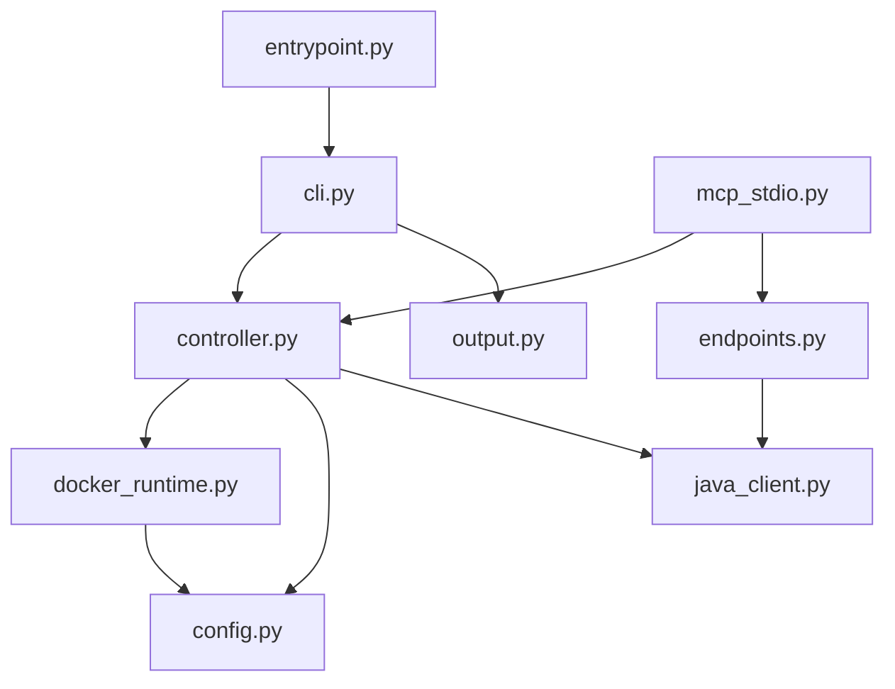

# LocalCloud CLI — Code Review

**Scope**: Architecture, code quality, and efficiency across all 15 source modules (~10,500 LOC) and 16 test files (~12,800 LOC).

---

## Executive Summary

LocalCloud CLI is a well-engineered, thoughtfully designed CLI for managing Docker-based GCP service emulation. The codebase demonstrates strong fundamentals: structured error handling, excellent test coverage with behavior-driven fakes, lazy imports for fast cold starts, and clean separation between terminal rendering and domain logic.

The primary weaknesses are **structural**: several modules have grown into God Objects that mix too many responsibilities, and the Docker API is queried inefficiently in hot paths. These are scaling concerns — the codebase works well today but will increasingly resist change.

### Scorecard

| Dimension | Grade | Summary |
|:---|:---:|:---|
| **Architecture** | B− | Clean layering (entrypoint → CLI → controller → runtime) but God Object files undermine it |
| **Code Quality** | B+ | Strong conventions, excellent error handling, good type discipline; DRY violations in lifecycle methods |
| **Efficiency** | B− | Smart lazy loading; but Docker N+1 queries and tight-loop log polling are costly |
| **Test Quality** | A− | High coverage, BDD naming, stateful fakes over brittle mocks; missing concurrency/fuzz tests |

---

## Architecture

### What's Good



- **Layered design**: Clear call hierarchy from `entrypoint` → `cli` → `controller` → `docker_runtime`, with no reverse dependencies.
- **Fast cold path**: [entrypoint.py](file:///Users/jsenjaliya/src/AI/localcloud-cli/src/localcloud_cli/entrypoint.py) intercepts `--version` and `guide` *before* importing the heavy `cli` module. This is a textbook CLI optimization.
- **Observer pattern**: [cli.py](file:///Users/jsenjaliya/src/AI/localcloud-cli/src/localcloud_cli/cli.py) uses `_ExecutionObserver` to decouple rendering from business logic, making the controller independently testable.
- **Structured errors everywhere**: A single [HostError](file:///Users/jsenjaliya/src/AI/localcloud-cli/src/localcloud_cli/errors.py) dataclass with `code`, `message`, and `details` flows through every layer, enabling consistent JSON or human output.
- **Configuration layering**: [config.py](file:///Users/jsenjaliya/src/AI/localcloud-cli/src/localcloud_cli/config.py) implements a six-level cascade (explicit path → env → CWD → remembered → home → packaged defaults) with recursive overlay merging.

### What Needs Improvement

#### 🔴 Critical: `docker_runtime.py` is a God Object

At **3,329 lines / 102 functions**, this single file handles container lifecycle, image management, port availability, health checking, network/volume management, label formatting, and Docker API wrapping.

> [!CAUTION]
> This is the single biggest risk to long-term maintainability. Every new Docker-related feature touches this file, increasing merge conflicts and cognitive load.

**Recommendation**: Decompose into a `runtime/` package:

```
localcloud_cli/runtime/
├── __init__.py          # Re-exports DockerRuntime, RuntimeRecord
├── models.py            # RuntimeRecord, DockerRunPlan, PublishedPorts
├── lifecycle.py         # create, start, stop, restart, remove
├── images.py            # pull, inspect, SHA normalization
├── ports.py             # port probing, diagnostics, alternative ranges
├── health.py            # wait_ready, is_ready, HTTP polling
├── cleanup.py           # cleanup_resources, _remove_children
└── labels.py            # label formatting helpers
```

#### 🔴 Critical: Controller duplicates lifecycle decision trees

[controller.py](file:///Users/jsenjaliya/src/AI/localcloud-cli/src/localcloud_cli/controller.py) `start()` (L106–329), `restart()` (L331–528), and `reset()` (L530–710) share nearly identical reconfiguration logic — computing run plans, deciding volume/network preservation, and previewing remove/create commands:

```python
# This pattern repeats across start (L197–220), restart (L423–445), reset (L602–624):
run_plan = self.runtime.plan_run(config, prepared_image[0], replacing=current)
preserve_volume = (current.data == "persistent" or current.ownership["data_volume"] == "attached")
preserve_network = current.network_name == config.network_name
commands = (
    *self.runtime.preview_remove_commands(..., remove_volume=not preserve_volume...),
    *self.runtime.preview_create_commands(..., volume_exists=preserve_volume...),
)
```

**Recommendation**: Extract a `_plan_replacement(current, config, prepared_image)` helper that returns a `ReplacementPlan` dataclass, eliminating the 3× duplication and the associated drift risk.

#### 🟠 Major: Controller is also a God Object

The `Controller` (43 methods, 1,910 lines) mixes:
- Orchestration (start/stop/restart)
- Payload serialization (`_payload()`: 165 lines of dict mapping at L1573–1738)
- Project creation with retry loops (`_ensure_project()`: L1426–1534)
- Raw Docker shell string construction (bypasses `DockerRuntime`)

**Recommendation**:
- Move `_payload()` to a dedicated serializer or `RuntimeRecord.to_payload()`
- Move `_ensure_project()` to `JavaMcpClient.ensure_project()`
- Route all Docker shell strings through `DockerRuntime` methods

#### 🟠 Major: `config.py` mixes static config with dynamic runtime state

[config.py](file:///Users/jsenjaliya/src/AI/localcloud-cli/src/localcloud_cli/config.py) handles YAML parsing *and* filesystem locking, `ActiveRuntime` state tracking, and JSON state file I/O. These are different lifecycles (load-once vs. mutated-at-runtime).

**Recommendation**: Split into `config.py` (YAML loading, overlay, validation) and `state.py` (runtime state, locking, active runtime persistence).

#### 🟡 Minor: Flat error hierarchy

[errors.py](file:///Users/jsenjaliya/src/AI/localcloud-cli/src/localcloud_cli/errors.py) defines a single `HostError` with string-based `code` field. Callers match on strings:

```python
# mcp_stdio.py L40
if error.code == "runtime_readiness_timeout":
```

**Recommendation**: Create typed subclasses (`DockerError`, `ConfigError`, `ReadinessError`) for `isinstance` dispatch while keeping `HostError.code` for serialization.

#### 🟡 Minor: CLI dispatch via if/elif chain

[cli.py](file:///Users/jsenjaliya/src/AI/localcloud-cli/src/localcloud_cli/cli.py) `_execute()` (L442) is a growing `if/elif` block. As commands grow, this becomes unwieldy.

**Recommendation**: Use `argparse.set_defaults(func=handler)` or a dispatch dictionary for O(1) routing.

---

## Code Quality

### Strengths

| Pattern | Example | Assessment |
|:---|:---|:---|
| YAML security hardening | [config.py](file:///Users/jsenjaliya/src/AI/localcloud-cli/src/localcloud_cli/config.py) `_StrictLoader` (L104–129) blocks aliases + duplicate keys | Prevents injection/confusion attacks |
| Configuration caching | `@lru_cache(maxsize=1)` for packaged defaults (L297) | Avoids repeat filesystem reads |
| Terminal degradation | [output.py](file:///Users/jsenjaliya/src/AI/localcloud-cli/src/localcloud_cli/output.py) TRUECOLOR → ANSI256 → ANSI16 → NONE | Textbook approach |
| Declarative field specs | `FieldSpec` model + dotted-path resolution | Highly extensible output formatting |
| Concurrency safety | `data_volume_lock()` via `fcntl` + threading guard | Prevents parallel CLI clobbering |
| Release provenance | [\_\_init\_\_.py](file:///Users/jsenjaliya/src/AI/localcloud-cli/src/localcloud_cli/__init__.py) embeds commit + date from `_release.json` | Every binary is traceable |
| Error UX | Unified error formatting in `main()` (L401–439) | Consistent across all commands |

### Issues

#### 🔴 Critical: Loopback endpoint validation uses whole-payload regex

[endpoints.py](file:///Users/jsenjaliya/src/AI/localcloud-cli/src/localcloud_cli/endpoints.py) `validate_local_endpoints` (L78–95) stringifies the **entire JSON payload** and runs regex searches for URLs:

```python
raw = json.dumps(payload)
if re.search(r"https?://(?!127\.0\.0\.1|localhost)[\w.-]+", raw):
    raise HostError(code="nonlocal_endpoint", ...)
```

> [!WARNING]
> If any field contains a descriptive URL (e.g., `{"docs": "https://cloud.google.com/..."}`), this will false-positive and crash the process. This is a safety-critical function that blocks production URL emission — it must be precise.

**Recommendation**: Walk the dictionary tree and only validate fields designated as endpoint values (URL, host, or emulator host fields), not arbitrary strings.

#### 🟠 Major: `output.py` does repeated O(N) ANSI-aware string processing

[output.py](file:///Users/jsenjaliya/src/AI/localcloud-cli/src/localcloud_cli/output.py) functions `_character_width()` (L267), `visible_width()` (L263), `truncate_visible()` (L284), and `_wrap_visible()` (L378) strip ANSI sequences and compute widths on every call. These are called in nested loops during table rendering.

**Recommendation**: Pre-compute visible widths before entering rendering loops, or adopt a layout library like `rich` that handles this efficiently.

#### 🟡 Minor: Silent MCP message dropping

[mcp_stdio.py](file:///Users/jsenjaliya/src/AI/localcloud-cli/src/localcloud_cli/mcp_stdio.py) ~L236: When response validation fails, the code `continue`s silently, leaving the MCP client hanging with no response for that request ID.

**Recommendation**: Log dropped messages to `sys.stderr` so developers can diagnose protocol issues.

#### 🟡 Minor: Fragile string parsing in output layer

[output.py](file:///Users/jsenjaliya/src/AI/localcloud-cli/src/localcloud_cli/output.py) `_render_image_value` uses `value.find(" (")` to split display strings. If upstream formatting changes, this silently breaks.

**Recommendation**: Pass structured data (separate `name` and `suffix` fields) to the view layer instead of parsing formatted strings.

---

## Efficiency

### Strengths

- **Lazy imports**: Heavy modules (`yaml`, `docker`, `httpx`) are imported only when needed, keeping `lc --version` and `lc guide` fast.
- **Incremental log tailing**: `_tail_runtime_logs()` uses a `since` parameter for incremental fetching, avoiding O(N²) re-diffing.
- **LRU-cached defaults**: Packaged YAML defaults are loaded once and memoized.

### Issues

#### 🔴 Critical: Docker API N+1 queries and missing filters

The Docker client is queried without server-side filters in multiple hot paths:

| Location | Issue | Impact |
|:---|:---|:---|
| `_remove_children()` (L2388) | `client.containers.list(all=True)` fetches **all** containers on the host | O(total containers) instead of O(managed containers) |
| `port_diagnostics()` (L1427) | Lists all running containers to check port conflicts | Same; should use `filters={"label": MANAGED_LABEL}` |
| `resolve()` (L256–260) | Lists containers then calls `container.reload()` in a loop | N+1 API calls per matched container |
| `doctor()` (L1309) | Fetches all containers, networks, and volumes unfiltered | Scans entire Docker universe |

**Recommendation**: Use Docker API `filters` parameter (labels, volume binds) to push filtering to the daemon, reducing payload size and network round-trips.

#### 🔴 Critical: Tight-loop log polling during readiness wait

[docker_runtime.py](file:///Users/jsenjaliya/src/AI/localcloud-cli/src/localcloud_cli/docker_runtime.py) `wait_ready()` (L1630) calls `_emit_logs()` → `_container_logs(container, tail=12)` on **every tick** of the readiness polling loop. This hammers the Docker daemon's log API multiple times per second.

**Recommendation**: Fetch logs only on a backoff timer (e.g., every 5 seconds) or only after a readiness failure, not on every poll tick.

#### 🟡 Minor: Duplicate readiness polling loops

Both `Controller.target()` (L832–951) and `Controller._ensure_project()` (L1436–1534) manually manage `while True` loops with deadline arithmetic.

**Recommendation**: Extract a reusable `wait_for_condition(fn, timeout, interval)` utility.

#### 🟡 Minor: Over-engineered port formatting

`_format_port_args()` (L2752–2836) implements a complex sorting/grouping algorithm to collapse contiguous 1:1 port ranges into Docker's range syntax — purely for prettier `--debug` output.

**Recommendation**: Use simple `{host}:{container}` port arguments. The compression saves a few characters in debug output at the cost of ~85 lines of non-trivial code.

---

## Test Quality

### Strengths

| Aspect | Assessment |
|:---|:---|
| **Coverage** | All 15 source modules have corresponding test files. Critical paths (lifecycle, config, docker) are heavily tested |
| **Naming** | BDD-style names: `test_start_readiness_deadline_begins_after_slow_image_pull` |
| **Fakes over mocks** | Stateful fakes (`FakeRuntime`, `FakeJavaClient`, `FakeClock`) assert on resulting state rather than call counts — far less brittle |
| **Parametrize** | Extensive `@pytest.mark.parametrize` for input variants |
| **Isolation** | `tmp_path` for filesystem, `monkeypatch` for env, `capsys` for output |
| **Integration tests** | Separate `tests/integration/` directory for end-to-end scenarios |
| **Ratio** | ~12,800 test LOC vs ~10,500 source LOC (1.2:1) — healthy |

### Gaps

| Missing | Risk | Recommendation |
|:---|:---|:---|
| **Property-based testing** | Config merging has a massive input space | Add `hypothesis` strategies for YAML overlay edge cases |
| **Concurrent access tests** | File locking is tested minimally | Test parallel CLI invocations on the same volume |
| **MCP protocol edge cases** | Only happy-path MCP flows tested | Test malformed JSON-RPC, oversized payloads, connection drops |
| **Performance benchmarks** | No timing assertions | Add benchmarks for `resolve()`, `wait_ready()`, config loading |

---

## File-Level Summary

| File | Lines | Functions | Role | Key Issue |
|:---|---:|---:|:---|:---|
| [docker_runtime.py](file:///Users/jsenjaliya/src/AI/localcloud-cli/src/localcloud_cli/docker_runtime.py) | 3,328 | 102 | Docker lifecycle, ports, health, images | God Object — split into package |
| [controller.py](file:///Users/jsenjaliya/src/AI/localcloud-cli/src/localcloud_cli/controller.py) | 1,910 | 43 | Command orchestration | Duplicate lifecycle logic, leaky payload |
| [config.py](file:///Users/jsenjaliya/src/AI/localcloud-cli/src/localcloud_cli/config.py) | 1,466 | 47 | Config loading + runtime state | Mixed static/dynamic concerns |
| [output.py](file:///Users/jsenjaliya/src/AI/localcloud-cli/src/localcloud_cli/output.py) | 1,460 | 63 | Terminal rendering | O(N) ANSI processing in loops |
| [cli.py](file:///Users/jsenjaliya/src/AI/localcloud-cli/src/localcloud_cli/cli.py) | 1,179 | 31 | Arg parsing, dispatch | if/elif dispatch chain |
| [endpoints.py](file:///Users/jsenjaliya/src/AI/localcloud-cli/src/localcloud_cli/endpoints.py) | 261 | — | Endpoint rewriting + validation | Whole-payload regex validation |
| [java_client.py](file:///Users/jsenjaliya/src/AI/localcloud-cli/src/localcloud_cli/java_client.py) | 266 | — | Java MCP HTTP client | Clean, well-scoped |
| [mcp_stdio.py](file:///Users/jsenjaliya/src/AI/localcloud-cli/src/localcloud_cli/mcp_stdio.py) | 238 | — | MCP stdio bridge | Silent message drops |
| [agent_guide.py](file:///Users/jsenjaliya/src/AI/localcloud-cli/src/localcloud_cli/agent_guide.py) | 180 | — | Agent guide rendering | Clean |
| [update.py](file:///Users/jsenjaliya/src/AI/localcloud-cli/src/localcloud_cli/update.py) | 94 | — | Self-update | Clean |
| Others | 129 | — | Init, entry, errors, constants | Minimal but solid |

---

## Recommended Priority Order

| Priority | Action | Impact | Effort |
|:---:|:---|:---|:---|
| 1 | Add Docker API filters to N+1 queries | Performance: reduce daemon load significantly | Low |
| 2 | Fix endpoint validation to walk tree, not regex payload | Correctness: prevent false-positive safety blocks | Low |
| 3 | Rate-limit log polling in `wait_ready()` | Performance: stop hammering Docker log API | Low |
| 4 | Extract `_plan_replacement()` from 3 lifecycle methods | Maintainability: eliminate drift risk | Medium |
| 5 | Split `docker_runtime.py` into `runtime/` package | Maintainability: unlock parallel development | Medium |
| 6 | Split `config.py` into config + state | Architecture: cleaner separation | Medium |
| 7 | Move `_payload()` and `_ensure_project()` out of Controller | Architecture: thinner controller | Medium |
| 8 | Add property-based and concurrency tests | Correctness: cover combinatorial edge cases | Medium |
| 9 | Pre-compute visible widths in output rendering | Performance: reduce O(N²) string ops | Low |
| 10 | Create typed error subclasses | Quality: enable `isinstance` dispatch | Low |
