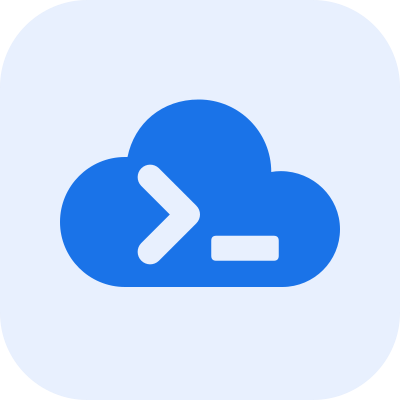

# LocalCloud



**Give your coding agent a cloud environment it can actually work with.**

LocalCloud connects your coding agent to a local environment for building, testing, and debugging Google Cloud applications. Through MCP, your agent can discover services, obtain SDK connection settings, inspect resources, query data, and investigate failures—then use standard Google Cloud SDKs to exercise the application.

Ask it to build a Cloud Storage workflow, test a Pub/Sub consumer, or validate a BigQuery query. Your agent can run the code, check the results, and iterate against local services without provisioning a live Google Cloud project.

## Why use it?

- **Zero Google Cloud service charges for local workflows.** Exercise supported services locally without provisioning billable Google Cloud resources.
- **One-command startup.** Start the environment with `lc start --local-only`. The first run may download the Docker image.
- **Projects for every experiment.** Create local projects for prototypes, test suites, and agent tasks, within your machine's capacity. Projects share the selected runtime; they are not a security boundary.
- **Standard SDKs and visible results.** Verify actual application behavior with SDK tests, resource inspection, queries, readiness checks, and diagnostics.

## Requirements

Docker engine, LocalCloud CLI, and the LocalCloud Docker image. The CLI runs natively on **macOS and Linux** and obtains the image when needed.

Install the CLI and check Docker:

```sh
brew install LocalGCloud/tap/localcloud
lc doctor
lc start --local-only
```

For the official installer or native archives, see the [MCP setup guide](https://local.cloud/docs/mcp/).

## Install in Claude Code

```text
/plugin marketplace add LocalGCloud/localcloud-cli
/plugin install localcloud@localcloud
```

Enable the plugin and reconnect MCP. Use the marketplace plugin or the CLI's direct MCP installer for a client, so you do not register duplicate servers.

Local MCP tools run in Claude Code and in Cowork sessions that run on your computer. Claude chat on the web and mobile can load the workflow guidance; local MCP execution requires a supported local session.

## Install in Codex

```sh
codex plugin marketplace add LocalGCloud/localcloud-cli --ref main
codex plugin add localcloud@localcloud
```

Open the Plugins Directory in Codex desktop, select the LocalCloud marketplace, and enable LocalCloud. A GitHub marketplace source and a vendor's public directory listing are separate distribution paths.

## Try a workflow

- Build and test a Cloud Storage upload-and-read workflow with LocalCloud using the standard Python SDK.
- Test a Pub/Sub publisher and consumer with LocalCloud, then verify the message is received and acknowledged.
- Run a BigQuery query against LocalCloud test data and assert the expected result.

Your coding client supplies code execution; the plugin supplies the MCP connection and workflow guidance. Start by discovering readiness, compatibility, and SDK settings rather than guessing service ports.

## Troubleshooting and removal

If the CLI cannot be found, install it and restart the client. The launchers search PATH and standard Homebrew locations. Claude's launcher runs the fixed `localcloud mcp` command through literal paths so the directory can inspect it. For a custom CLI location that Claude Code cannot find on PATH, or to pass MCP options, use `lc mcp install --client claude-code` with the options in the [setup guide](https://local.cloud/docs/mcp/) instead of the plugin's MCP entry. For other clients, follow their setup section in that guide. If Docker is unavailable, start your Docker engine and run `lc doctor`. For an existing older environment, update deliberately using the setup guide; installing this plugin does not replace it.

Remove with `/plugin uninstall localcloud@localcloud` in Claude Code or `codex plugin remove localcloud@localcloud` in Codex. Plugin removal does not delete your LocalCloud Docker data.

## Permissions, privacy, and license

MCP management writes and destructive operations are disabled by default. SDK application writes still occur during requested workflows. Compatibility varies by service and operation; validate application release behavior against Google Cloud before production deployment.

Local execution does not guarantee zero network traffic. Downloads, update checks, telemetry, and documented outbound features can contact external services, and MCP results are shared with your agent client. See the [CLI and MCP privacy policy](https://github.com/LocalGCloud/localcloud-cli/blob/main/docs/mcp-privacy.md) and [runtime privacy and outbound data](https://local.cloud/docs/privacy/).

The CLI can send operational telemetry to LocalCloud's analytics processor, PostHog (`us.i.posthog.com`). Opt out of CLI telemetry with `LOCALCLOUD_TELEMETRY=false` or `DO_NOT_TRACK=1`; the linked reference describes the runtime's separate controls and outbound behavior. Persistent local application data can stay in your Docker volume until you delete it.

The plugin and CLI are governed by the [LocalCloud Public Preview License](LICENSE). The runtime is obtained separately under the terms supplied with that image. This plugin contains public CLI integration files and no runtime implementation.

[Website](https://local.cloud/) · [Detailed installation guide](https://github.com/LocalGCloud/localcloud-cli/blob/main/docs/mcp-marketplace-guide.md) · [Support and security reports](https://local.cloud/security/)
